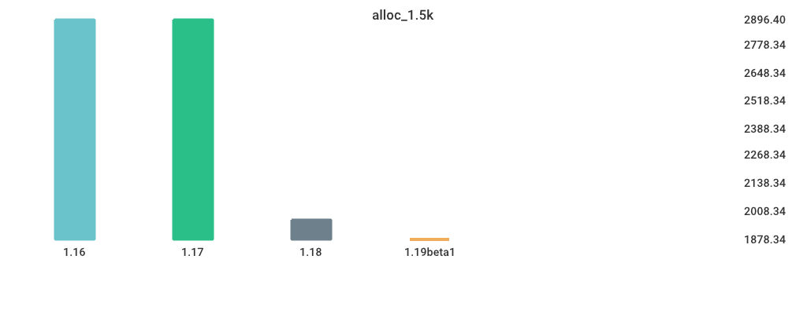

# Benchmarks

## alloc_1.5k

| Version | Build Time (ms) | Run Time (ms) |
| ------ | ------ | ------ |
| 1.16 | 1135.160300 | 2896.399780 |
| 1.17 | 1151.930760 | 2893.932940 |
| 1.18 | 1150.387700 | 1968.188900 |
| 1.19beta1 | 1830.875480 | 1878.336920 |

## loop

| Version | Build Time (ms) | Run Time (ms) |
| ------ | ------ | ------ |
| 1.16 | 1140.519540 | 1128.268600 |
| 1.17 | 1161.002740 | 1134.360780 |
| 1.18 | 1128.741640 | 1130.999360 |
| 1.19beta1 | 1775.574360 | 1137.212040 |

## switch-case

| Version | Build Time (ms) | Run Time (ms) |
| ------ | ------ | ------ |
| 1.16 | 1456.376080 | 4512.450660 |
| 1.17 | 1514.662300 | 4611.179160 |
| 1.18 | 1487.793760 | 4602.192480 |
| 1.19beta1 | 2124.521160 | 2718.251400 |

