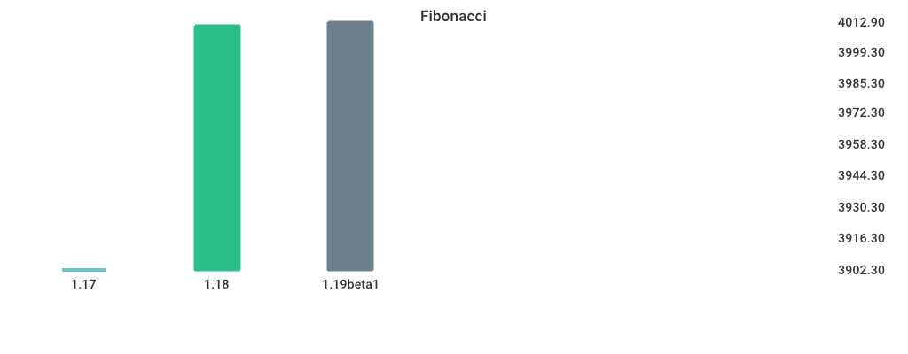
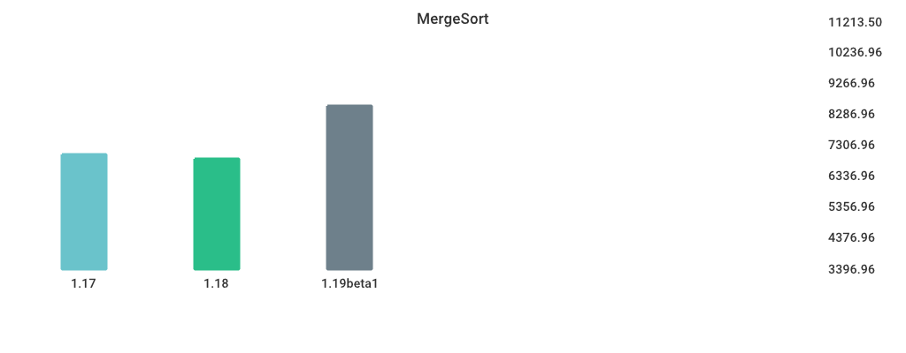
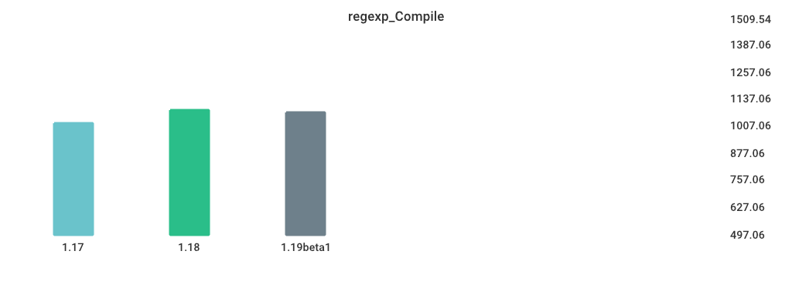
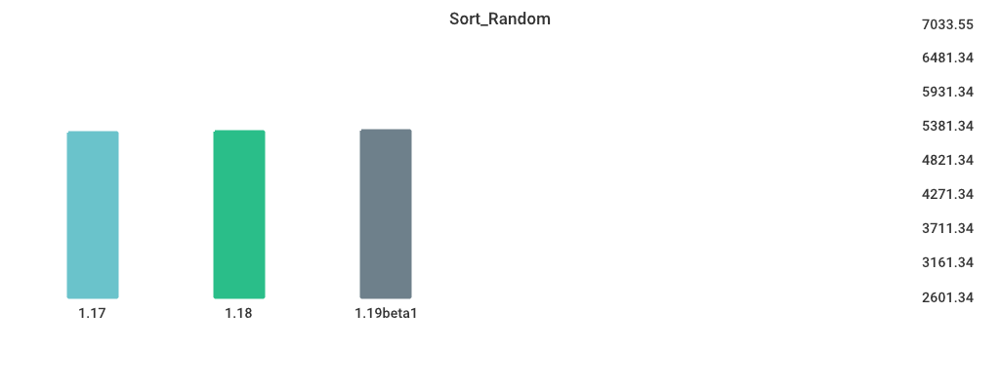
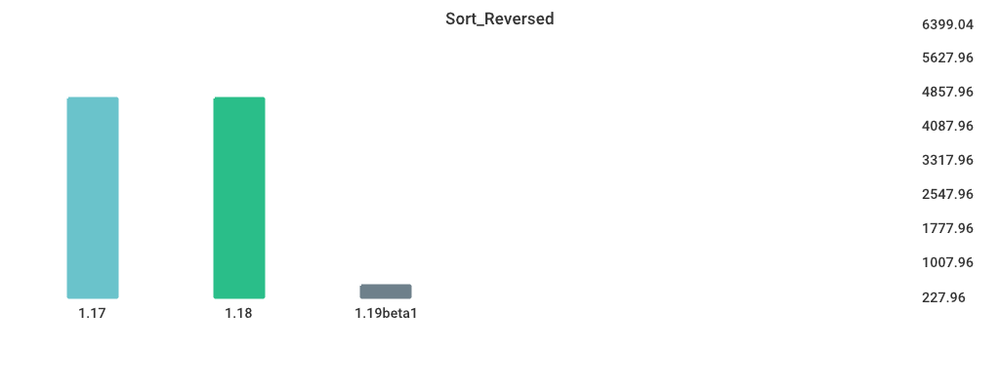
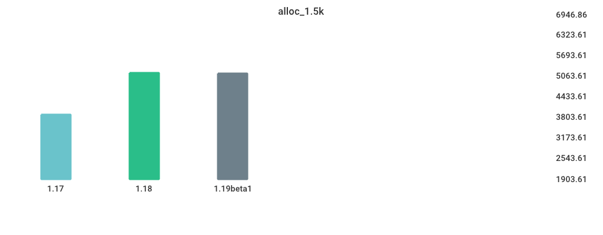

# Benchmarks

## Environment

NumCPU: 2
Arch: amd64
OS: linux
Version: go1.18.3
Itercount: 10
### CPU 0

Model: Intel(R) Xeon(R) Platinum 8171M CPU @ 2.60GHz
Cores: 1
Mhz: 2095.213000
CacheSize: 36608
Microcode: 0xffffffff

### CPU 1

Model: Intel(R) Xeon(R) Platinum 8171M CPU @ 2.60GHz
Cores: 1
Mhz: 2095.213000
CacheSize: 36608
Microcode: 0xffffffff

## Fibonacci

| Version | Build Time (ms) | Standard Deviation | Run Time (ms) | Standard Deviation |
| ------ | ------ | ------ | ------ | ------ |
| 1.17 | 135.307085 | 8.714707 | 4339.859639 | 113.922099 |
| 1.18 | 145.636137 | 5.989373 | 4458.423974 | 201.208822 |
| 1.19beta1 | 313.292764 | 9.431900 | 4698.479059 | 123.685308 |

## MergeSort

| Version | Build Time (ms) | Standard Deviation | Run Time (ms) | Standard Deviation |
| ------ | ------ | ------ | ------ | ------ |
| 1.17 | 146.244450 | 20.734523 | 6718.034756 | 128.246575 |
| 1.18 | 152.928436 | 7.290120 | 6634.192702 | 216.541353 |
| 1.19beta1 | 324.113242 | 8.752136 | 7879.662863 | 221.065499 |

## regexp_Compile

| Version | Build Time (ms) | Standard Deviation | Run Time (ms) | Standard Deviation |
| ------ | ------ | ------ | ------ | ------ |
| 1.17 | 167.632748 | 5.642556 | 1219.174792 | 29.490949 |
| 1.18 | 184.640895 | 6.027306 | 1321.646633 | 23.799109 |
| 1.19beta1 | 333.696885 | 10.779134 | 1308.474975 | 26.544246 |

## Sort_Random

| Version | Build Time (ms) | Standard Deviation | Run Time (ms) | Standard Deviation |
| ------ | ------ | ------ | ------ | ------ |
| 1.17 | 160.542469 | 2.606886 | 5770.929937 | 149.712536 |
| 1.18 | 171.056200 | 11.972329 | 5709.436578 | 166.914181 |
| 1.19beta1 | 337.087855 | 17.267750 | 5902.501830 | 116.516840 |

## Sort_Reversed

| Version | Build Time (ms) | Standard Deviation | Run Time (ms) | Standard Deviation |
| ------ | ------ | ------ | ------ | ------ |
| 1.17 | 154.040699 | 4.301011 | 4303.653237 | 138.862400 |
| 1.18 | 156.760880 | 5.209250 | 3989.440311 | 226.391962 |
| 1.19beta1 | 328.542395 | 10.978032 | 468.311868 | 26.306176 |

## switch_case

| Version | Build Time (ms) | Standard Deviation | Run Time (ms) | Standard Deviation |
| ------ | ------ | ------ | ------ | ------ |
| 1.17 | 233.732255 | 12.321913 | 5989.268008 | 110.440946 |
| 1.18 | 228.322350 | 5.853133 | 6577.175979 | 152.856681 |
| 1.19beta1 | 400.898550 | 21.921881 | 3731.064596 | 73.365175 |

## alloc_1.5k

| Version | Build Time (ms) | Standard Deviation | Run Time (ms) | Standard Deviation |
| ------ | ------ | ------ | ------ | ------ |
| 1.17 | 144.234146 | 3.673310 | 3728.988715 | 48.272887 |
| 1.18 | 148.293747 | 11.085586 | 5104.910673 | 153.867499 |
| 1.19beta1 | 324.028612 | 15.865018 | 4831.317506 | 106.325775 |

