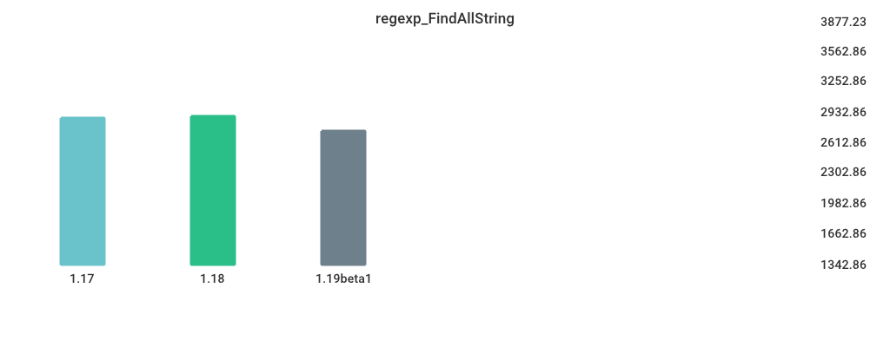

# Benchmarks

## Environment

NumCPU: 2

Arch: amd64

OS: linux

Version: go1.18.3

Itercount: 10

### CPU 0

Model: Intel(R) Xeon(R) CPU E5-2673 v4 @ 2.30GHz

Cores: 1

Mhz: 2294.686000

CacheSize: 51200

Microcode: 0xffffffff

### CPU 1

Model: Intel(R) Xeon(R) CPU E5-2673 v4 @ 2.30GHz

Cores: 1

Mhz: 2294.686000

CacheSize: 51200

Microcode: 0xffffffff

## regexp_FindAllString

| Version | Build Time (ms) | Standard Deviation | Run Time (ms) | Standard Deviation |
| ------ | ------ | ------ | ------ | ------ |
| 1.17 | 195.929333 | 6.057766 | 2828.291948 | 85.204333 |
| 1.18 | 191.205604 | 8.163555 | 2596.169134 | 77.616858 |
| 1.19beta1 | 363.384961 | 9.113445 | 2553.146159 | 34.974015 |

## Sort_Random

| Version | Build Time (ms) | Standard Deviation | Run Time (ms) | Standard Deviation |
| ------ | ------ | ------ | ------ | ------ |
| 1.17 | 175.165259 | 5.693571 | 5233.532098 | 87.986669 |
| 1.18 | 175.670905 | 12.839856 | 5090.399645 | 87.347573 |
| 1.19beta1 | 355.685816 | 12.307653 | 5139.460999 | 60.886234 |

## Sort_Reversed

| Version | Build Time (ms) | Standard Deviation | Run Time (ms) | Standard Deviation |
| ------ | ------ | ------ | ------ | ------ |
| 1.17 | 148.583308 | 8.348949 | 4008.336052 | 80.629729 |
| 1.18 | 166.580593 | 9.213555 | 4021.703131 | 101.365043 |
| 1.19beta1 | 327.914266 | 16.442923 | 402.162895 | 9.738931 |

## switch_case

| Version | Build Time (ms) | Standard Deviation | Run Time (ms) | Standard Deviation |
| ------ | ------ | ------ | ------ | ------ |
| 1.17 | 241.786218 | 8.356953 | 6188.911654 | 86.737469 |
| 1.18 | 227.940825 | 23.693046 | 6081.273211 | 143.774524 |
| 1.19beta1 | 396.189709 | 20.434339 | 3563.950055 | 113.477415 |

## alloc_1.5k

| Version | Build Time (ms) | Standard Deviation | Run Time (ms) | Standard Deviation |
| ------ | ------ | ------ | ------ | ------ |
| 1.17 | 135.227653 | 4.697778 | 3526.674977 | 91.115692 |
| 1.18 | 146.410686 | 6.216280 | 2331.217804 | 56.594910 |
| 1.19beta1 | 298.498546 | 11.491245 | 2402.170558 | 75.034890 |

## Fibonacci

| Version | Build Time (ms) | Standard Deviation | Run Time (ms) | Standard Deviation |
| ------ | ------ | ------ | ------ | ------ |
| 1.17 | 147.994542 | 7.203599 | 3963.910181 | 47.820747 |
| 1.18 | 146.803784 | 12.031278 | 3960.420526 | 51.302936 |
| 1.19beta1 | 315.839295 | 15.308783 | 3987.007513 | 76.568563 |

## MergeSort

| Version | Build Time (ms) | Standard Deviation | Run Time (ms) | Standard Deviation |
| ------ | ------ | ------ | ------ | ------ |
| 1.17 | 151.142048 | 10.582772 | 7403.846653 | 106.897538 |
| 1.18 | 156.465829 | 17.520990 | 6934.100549 | 246.170613 |
| 1.19beta1 | 326.372908 | 12.605839 | 8769.797689 | 135.639158 |

## regexp_Compile

| Version | Build Time (ms) | Standard Deviation | Run Time (ms) | Standard Deviation |
| ------ | ------ | ------ | ------ | ------ |
| 1.17 | 181.559510 | 7.631190 | 1184.946245 | 39.653741 |
| 1.18 | 180.003351 | 5.957457 | 1230.829195 | 25.072946 |
| 1.19beta1 | 337.988729 | 6.762227 | 1299.189560 | 51.166327 |

