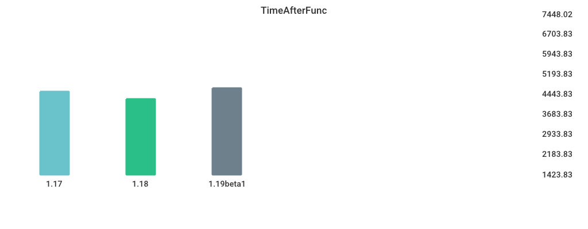

# Benchmarks

## Environment

NumCPU: 2

Arch: amd64

OS: linux

Version: go1.18.3

Itercount: 10

### CPU 0

Model: Intel(R) Xeon(R) Platinum 8370C CPU @ 2.80GHz

Cores: 1

Mhz: 2793.437000

CacheSize: 49152

Microcode: 0xffffffff

### CPU 1

Model: Intel(R) Xeon(R) Platinum 8370C CPU @ 2.80GHz

Cores: 1

Mhz: 2793.437000

CacheSize: 49152

Microcode: 0xffffffff

## MergeSort

| Version | Build Time (ms) | Standard Deviation | Run Time (ms) | Standard Deviation |
| ------ | ------ | ------ | ------ | ------ |
| 1.17 | 126.445971 | 4.343474 | 5971.371748 | 43.908024 |
| 1.18 | 133.532413 | 5.317584 | 5638.886678 | 35.599196 |
| 1.19beta1 | 272.150836 | 5.412629 | 7006.107745 | 81.990408 |

## regexp_Compile

| Version | Build Time (ms) | Standard Deviation | Run Time (ms) | Standard Deviation |
| ------ | ------ | ------ | ------ | ------ |
| 1.17 | 159.905379 | 17.368643 | 1073.386710 | 5.421854 |
| 1.18 | 171.479875 | 11.475296 | 1130.668635 | 11.727510 |
| 1.19beta1 | 299.258712 | 6.014528 | 1139.155471 | 6.316724 |

## alloc_1.5k

| Version | Build Time (ms) | Standard Deviation | Run Time (ms) | Standard Deviation |
| ------ | ------ | ------ | ------ | ------ |
| 1.17 | 123.246889 | 4.239781 | 3699.514380 | 19.041135 |
| 1.18 | 131.254476 | 2.523092 | 5218.870049 | 3.120076 |
| 1.19beta1 | 269.245641 | 3.467836 | 5218.990958 | 0.974535 |

## Fibonacci

| Version | Build Time (ms) | Standard Deviation | Run Time (ms) | Standard Deviation |
| ------ | ------ | ------ | ------ | ------ |
| 1.17 | 121.491596 | 9.199736 | 4792.049039 | 0.715373 |
| 1.18 | 128.280396 | 6.911127 | 4796.623045 | 9.308312 |
| 1.19beta1 | 265.209260 | 1.328158 | 4796.203515 | 0.904032 |

## regexp_FindAllString

| Version | Build Time (ms) | Standard Deviation | Run Time (ms) | Standard Deviation |
| ------ | ------ | ------ | ------ | ------ |
| 1.17 | 161.448049 | 2.094880 | 2340.524249 | 12.142399 |
| 1.18 | 171.944136 | 3.831416 | 2339.708307 | 24.620148 |
| 1.19beta1 | 313.230059 | 13.724333 | 2195.443536 | 13.101164 |

## Sort_Random

| Version | Build Time (ms) | Standard Deviation | Run Time (ms) | Standard Deviation |
| ------ | ------ | ------ | ------ | ------ |
| 1.17 | 142.295276 | 1.972333 | 6083.362689 | 11.884848 |
| 1.18 | 149.480147 | 4.265872 | 5975.832518 | 11.959284 |
| 1.19beta1 | 282.859976 | 2.438320 | 5928.360416 | 7.457862 |

## Sort_Reversed

| Version | Build Time (ms) | Standard Deviation | Run Time (ms) | Standard Deviation |
| ------ | ------ | ------ | ------ | ------ |
| 1.17 | 128.821037 | 9.725939 | 3644.798354 | 30.828604 |
| 1.18 | 140.377492 | 8.457870 | 3543.136103 | 2.775879 |
| 1.19beta1 | 271.495174 | 3.446811 | 395.341676 | 2.201207 |

## switch_case

| Version | Build Time (ms) | Standard Deviation | Run Time (ms) | Standard Deviation |
| ------ | ------ | ------ | ------ | ------ |
| 1.17 | 190.897027 | 12.479754 | 5955.346543 | 33.381414 |
| 1.18 | 197.992204 | 10.933175 | 5906.589013 | 21.148788 |
| 1.19beta1 | 325.690769 | 8.146437 | 3415.978383 | 1.749769 |

## TimeAfterFunc

| Version | Build Time (ms) | Standard Deviation | Run Time (ms) | Standard Deviation |
| ------ | ------ | ------ | ------ | ------ |
| 1.17 | 143.947149 | 2.340303 | 4540.570155 | 459.796826 |
| 1.18 | 155.991258 | 85.005565 | 4254.183891 | 853.902550 |
| 1.19beta1 | 287.659058 | 41.301349 | 4671.111671 | 343.332700 |

