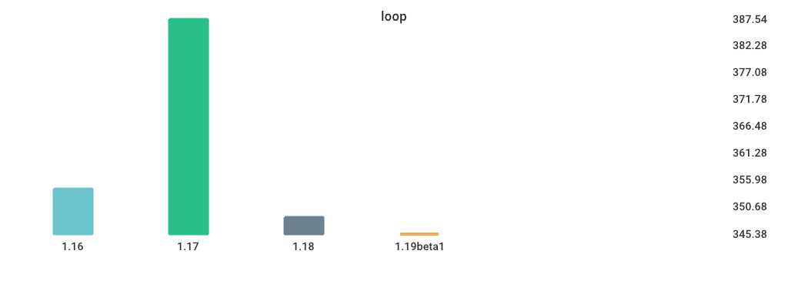
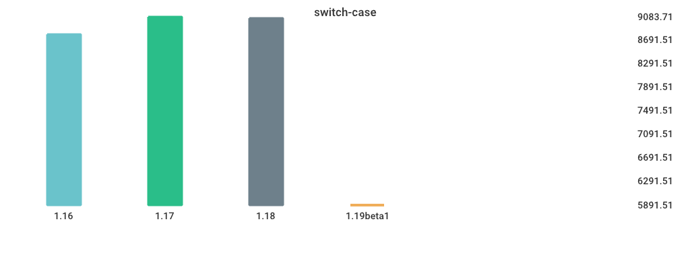

# Benchmarks

## loop

| Version | Build Time (ms) | Run Time (ms) |
| ------ | ------ | ------ |
| 1.16 | 1344.832720 | 354.223400 |
| 1.17 | 1253.796180 | 387.541060 |
| 1.18 | 1229.359220 | 348.652940 |
| 1.19beta1 | 1856.467680 | 345.379960 |

## switch-case

| Version | Build Time (ms) | Run Time (ms) |
| ------ | ------ | ------ |
| 1.16 | 1550.706580 | 8783.793000 |
| 1.17 | 1563.767240 | 9083.710160 |
| 1.18 | 1575.895220 | 9058.731940 |
| 1.19beta1 | 2213.014460 | 5891.513120 |

