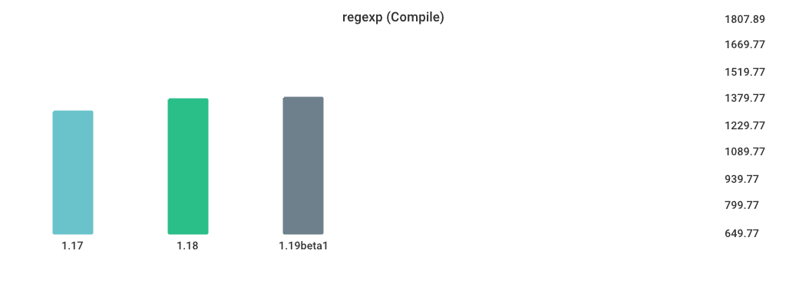
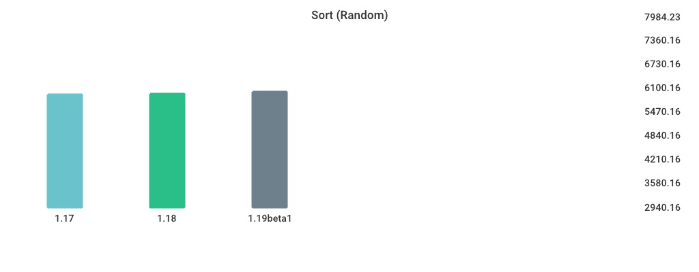
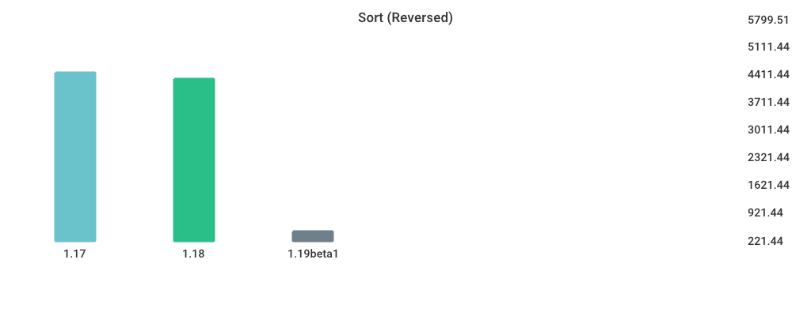

# Benchmarks

## Environment

NumCPU: 2
Arch: amd64
OS: linux
Version: go1.18.3
Itercount: 10
### CPU 0

Model: Intel(R) Xeon(R) Platinum 8171M CPU @ 2.60GHz
Cores: 1
Mhz: 2095.196000
CacheSize: 36608
Microcode: 0xffffffff

### CPU 1

Model: Intel(R) Xeon(R) Platinum 8171M CPU @ 2.60GHz
Cores: 1
Mhz: 2095.196000
CacheSize: 36608
Microcode: 0xffffffff

## MergeSort

| Version | Build Time (ms) | Standard Deviation | Run Time (ms) | Standard Deviation |
| ------ | ------ | ------ | ------ | ------ |
| 1.17 | 150.348662 | 15.853428 | 7089.168803 | 62.592027 |
| 1.18 | 154.264884 | 4.191449 | 6820.297801 | 63.818212 |
| 1.19beta1 | 330.538934 | 5.156748 | 8559.147340 | 90.351983 |

## regexp (Compile)

| Version | Build Time (ms) | Standard Deviation | Run Time (ms) | Standard Deviation |
| ------ | ------ | ------ | ------ | ------ |
| 1.17 | 191.360455 | 6.678284 | 1318.801561 | 9.714197 |
| 1.18 | 192.153448 | 6.597331 | 1405.294146 | 23.430624 |
| 1.19beta1 | 353.882023 | 5.247217 | 1416.917205 | 30.942236 |

## Sort (Random)

| Version | Build Time (ms) | Standard Deviation | Run Time (ms) | Standard Deviation |
| ------ | ------ | ------ | ------ | ------ |
| 1.17 | 167.870596 | 5.116242 | 5920.544576 | 52.786317 |
| 1.18 | 180.750758 | 6.279065 | 5944.630965 | 65.441049 |
| 1.19beta1 | 339.798310 | 8.954478 | 5985.220391 | 54.459255 |

## Sort (Reversed)

| Version | Build Time (ms) | Standard Deviation | Run Time (ms) | Standard Deviation |
| ------ | ------ | ------ | ------ | ------ |
| 1.17 | 156.711437 | 5.628637 | 4450.415264 | 82.690022 |
| 1.18 | 166.108667 | 3.977135 | 4242.985040 | 63.244815 |
| 1.19beta1 | 333.654955 | 5.014153 | 446.339269 | 10.079495 |

## switch-case

| Version | Build Time (ms) | Standard Deviation | Run Time (ms) | Standard Deviation |
| ------ | ------ | ------ | ------ | ------ |
| 1.17 | 230.750853 | 10.220744 | 6208.462280 | 54.265331 |
| 1.18 | 232.802627 | 11.146732 | 6832.173033 | 90.540932 |
| 1.19beta1 | 399.999107 | 7.354559 | 3893.857855 | 25.304309 |

## alloc_1.5k

| Version | Build Time (ms) | Standard Deviation | Run Time (ms) | Standard Deviation |
| ------ | ------ | ------ | ------ | ------ |
| 1.17 | 144.159192 | 2.435024 | 3871.249986 | 41.554083 |
| 1.18 | 155.696615 | 9.376130 | 5162.688759 | 66.861435 |
| 1.19beta1 | 332.458689 | 12.083532 | 5143.618080 | 69.624498 |

## Fibonacci

| Version | Build Time (ms) | Standard Deviation | Run Time (ms) | Standard Deviation |
| ------ | ------ | ------ | ------ | ------ |
| 1.17 | 143.255946 | 4.707952 | 4610.885252 | 50.943452 |
| 1.18 | 156.507955 | 6.654765 | 4730.519360 | 28.192414 |
| 1.19beta1 | 322.595323 | 12.251884 | 4751.532231 | 25.694831 |

