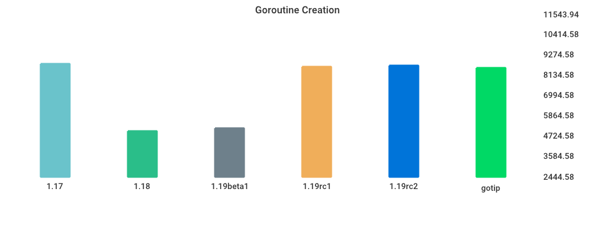

# Benchmarks

## Environment

NumCPU: 2

Arch: amd64

OS: linux

Version: go1.18.4

Itercount: 10

### CPU 0

Model: Intel(R) Xeon(R) Platinum 8272CL CPU @ 2.60GHz

Cores: 1

Mhz: 2593.907000

CacheSize: 36608

Microcode: 0xffffffff

### CPU 1

Model: Intel(R) Xeon(R) Platinum 8272CL CPU @ 2.60GHz

Cores: 1

Mhz: 2593.907000

CacheSize: 36608

Microcode: 0xffffffff

## alloc_1.5k

| Version | Build Time (ms) | Standard Deviation | Run Time (ms) | Standard Deviation |
| ------ | ------ | ------ | ------ | ------ |
| 1.17 | 121.778902 | 3.090405 | 3147.533184 | 9.781658 |
| 1.18 | 131.625939 | 2.416535 | 4347.295525 | 1.004556 |
| 1.19beta1 | 271.677903 | 5.461665 | 4346.479769 | 1.313885 |
| 1.19rc1 | 148.841662 | 3.589006 | 2191.215154 | 0.585848 |
| 1.19rc2 | 143.946402 | 3.214029 | 2190.777076 | 1.438693 |
| gotip | 140.934678 | 2.848017 | 2191.066873 | 0.834126 |

## Fibonacci

| Version | Build Time (ms) | Standard Deviation | Run Time (ms) | Standard Deviation |
| ------ | ------ | ------ | ------ | ------ |
| 1.17 | 123.732686 | 2.638415 | 3901.133036 | 2.227452 |
| 1.18 | 130.530215 | 5.311707 | 4012.020290 | 1.336480 |
| 1.19beta1 | 273.541183 | 4.455444 | 4011.389773 | 1.448405 |
| 1.19rc1 | 151.948802 | 3.849949 | 3902.489991 | 1.665431 |
| 1.19rc2 | 143.902212 | 5.571575 | 3904.752952 | 1.175854 |
| gotip | 141.472035 | 6.095970 | 3901.368928 | 0.756874 |

## MergeSort

| Version | Build Time (ms) | Standard Deviation | Run Time (ms) | Standard Deviation |
| ------ | ------ | ------ | ------ | ------ |
| 1.17 | 129.264274 | 4.812247 | 5801.572625 | 48.591966 |
| 1.18 | 133.557234 | 2.906588 | 5572.679976 | 38.296552 |
| 1.19beta1 | 273.993424 | 4.749013 | 7063.479868 | 58.906931 |
| 1.19rc1 | 154.759101 | 2.269072 | 7071.467534 | 40.392553 |
| 1.19rc2 | 148.284811 | 6.891963 | 7357.093567 | 33.525433 |
| gotip | 148.035536 | 3.251428 | 7361.246592 | 75.920371 |

## regexp_Compile

| Version | Build Time (ms) | Standard Deviation | Run Time (ms) | Standard Deviation |
| ------ | ------ | ------ | ------ | ------ |
| 1.17 | 160.424510 | 8.854689 | 1086.705624 | 2.975363 |
| 1.18 | 167.749362 | 14.403462 | 1146.520303 | 98.705200 |
| 1.19beta1 | 308.174353 | 4.353851 | 1154.256665 | 4.959044 |
| 1.19rc1 | 180.193880 | 3.383097 | 1152.506464 | 7.600753 |
| 1.19rc2 | 168.130515 | 13.327667 | 1148.474475 | 3.147894 |
| gotip | 167.662956 | 4.955038 | 1165.655740 | 8.808661 |

## Sort_Reversed

| Version | Build Time (ms) | Standard Deviation | Run Time (ms) | Standard Deviation |
| ------ | ------ | ------ | ------ | ------ |
| 1.17 | 131.750985 | 3.968738 | 3711.070438 | 1.784045 |
| 1.18 | 139.664005 | 3.720176 | 3574.249483 | 1.303475 |
| 1.19beta1 | 271.721090 | 4.019944 | 369.294671 | 0.503612 |
| 1.19rc1 | 150.768192 | 2.506534 | 369.216363 | 0.414874 |
| 1.19rc2 | 142.866386 | 3.421006 | 369.304755 | 0.505077 |
| gotip | 141.647697 | 1.807547 | 369.730227 | 0.619815 |

## switch_case

| Version | Build Time (ms) | Standard Deviation | Run Time (ms) | Standard Deviation |
| ------ | ------ | ------ | ------ | ------ |
| 1.17 | 191.789771 | 7.839317 | 5201.208579 | 1.960818 |
| 1.18 | 197.876116 | 14.887944 | 5725.161971 | 2.251586 |
| 1.19beta1 | 328.284373 | 3.449614 | 3271.886978 | 0.977920 |
| 1.19rc1 | 222.353094 | 4.399757 | 3221.915682 | 0.906594 |
| 1.19rc2 | 198.851182 | 20.385707 | 3221.638079 | 1.124391 |
| gotip | 199.669734 | 3.372320 | 3221.838182 | 0.831304 |

## TimeAfterFunc

| Version | Build Time (ms) | Standard Deviation | Run Time (ms) | Standard Deviation |
| ------ | ------ | ------ | ------ | ------ |
| 1.17 | 143.831490 | 6.490107 | 5097.321713 | 377.201673 |
| 1.18 | 158.968186 | 75.338044 | 4128.892375 | 623.479923 |
| 1.19beta1 | 288.439871 | 78.310828 | 5001.341249 | 317.198744 |
| 1.19rc1 | 171.402766 | 7.731601 | 4627.763898 | 343.053824 |
| 1.19rc2 | 159.921533 | 103.604226 | 4694.722828 | 288.311018 |
| gotip | 158.132826 | 5.583839 | 4651.999924 | 309.027905 |

## Goroutine Creation

| Version | Build Time (ms) | Standard Deviation | Run Time (ms) | Standard Deviation |
| ------ | ------ | ------ | ------ | ------ |
| 1.17 | 134.208839 | 3.679144 | 8758.965520 | 61.839288 |
| 1.18 | 143.878750 | 13.184271 | 5004.970000 | 94.838242 |
| 1.19beta1 | 280.841054 | 5.616414 | 5162.715616 | 64.453467 |
| 1.19rc1 | 151.830209 | 2.607848 | 8605.222857 | 86.321438 |
| 1.19rc2 | 146.446099 | 3.053217 | 8681.965404 | 54.075896 |
| gotip | 143.271356 | 16.294258 | 8541.087072 | 69.440065 |

## regexp_FindAllString

| Version | Build Time (ms) | Standard Deviation | Run Time (ms) | Standard Deviation |
| ------ | ------ | ------ | ------ | ------ |
| 1.17 | 163.040746 | 2.730657 | 2347.140503 | 9.585542 |
| 1.18 | 172.385169 | 3.186749 | 2351.902350 | 13.211591 |
| 1.19beta1 | 304.759366 | 3.946175 | 2245.678931 | 9.707168 |
| 1.19rc1 | 188.763775 | 3.098879 | 2231.194034 | 8.791090 |
| 1.19rc2 | 171.958858 | 2.074021 | 2239.661232 | 12.013212 |
| gotip | 171.661253 | 2.481628 | 2235.018488 | 14.656813 |

## Sort_Random

| Version | Build Time (ms) | Standard Deviation | Run Time (ms) | Standard Deviation |
| ------ | ------ | ------ | ------ | ------ |
| 1.17 | 142.912225 | 4.679638 | 5010.980830 | 1.186145 |
| 1.18 | 149.790774 | 7.610420 | 5029.206888 | 3.473931 |
| 1.19beta1 | 284.759750 | 3.739570 | 5022.257472 | 2.060224 |
| 1.19rc1 | 161.453467 | 3.442674 | 5095.025425 | 5.470177 |
| 1.19rc2 | 153.154111 | 2.897271 | 5071.919353 | 2.202914 |
| gotip | 153.056796 | 2.736799 | 5079.863720 | 2.222579 |

