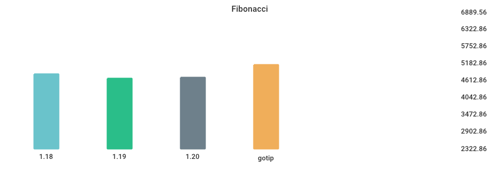

# Benchmarks

## Environment

NumCPU: 2

Arch: amd64

OS: linux

Version: go1.18.3

Itercount: 10

### CPU 0

Model: Intel(R) Xeon(R) Platinum 8370C CPU @ 2.80GHz

Cores: 1

Mhz: 2793.448000

CacheSize: 49152

Microcode: 0xffffffff

### CPU 1

Model: Intel(R) Xeon(R) Platinum 8370C CPU @ 2.80GHz

Cores: 1

Mhz: 2793.448000

CacheSize: 49152

Microcode: 0xffffffff

## TimeAfterFunc

| Version | Build Time (ms) | Standard Deviation | Run Time (ms) | Standard Deviation |
| ------ | ------ | ------ | ------ | ------ |
| 1.17 | 144.699889 | 2.049804 | 4439.949599 | 539.093679 |
| 1.18 | 153.352109 | 67.344183 | 4896.488325 | 833.629701 |
| 1.19beta1 | 285.497432 | 349.258335 | 4796.260632 | 359.886938 |
| gotip | 170.910393 | 9.423719 | 5095.602950 | 393.164258 |

## MergeSort

| Version | Build Time (ms) | Standard Deviation | Run Time (ms) | Standard Deviation |
| ------ | ------ | ------ | ------ | ------ |
| 1.17 | 127.681656 | 10.486193 | 6036.598942 | 59.869710 |
| 1.18 | 133.172512 | 5.976550 | 5799.824788 | 78.693013 |
| 1.19beta1 | 273.991573 | 3.181760 | 7009.774241 | 69.406203 |
| gotip | 154.818974 | 12.509304 | 7051.424463 | 60.708875 |

## regexp_Compile

| Version | Build Time (ms) | Standard Deviation | Run Time (ms) | Standard Deviation |
| ------ | ------ | ------ | ------ | ------ |
| 1.17 | 158.528007 | 5.268525 | 1071.895314 | 3.019450 |
| 1.18 | 165.913848 | 10.421409 | 1112.167368 | 4.130125 |
| 1.19beta1 | 301.236276 | 2.805893 | 1127.254353 | 4.654848 |
| gotip | 181.187615 | 3.673140 | 1136.396101 | 6.172180 |

## Sort_Random

| Version | Build Time (ms) | Standard Deviation | Run Time (ms) | Standard Deviation |
| ------ | ------ | ------ | ------ | ------ |
| 1.17 | 146.117203 | 2.236849 | 6089.745115 | 6.516011 |
| 1.18 | 152.959612 | 4.952519 | 5981.010281 | 4.761175 |
| 1.19beta1 | 288.167874 | 2.556119 | 5941.116619 | 13.289002 |
| gotip | 161.398949 | 3.800577 | 5935.163448 | 6.298795 |

## Sort_Reversed

| Version | Build Time (ms) | Standard Deviation | Run Time (ms) | Standard Deviation |
| ------ | ------ | ------ | ------ | ------ |
| 1.17 | 135.666673 | 1.144842 | 3643.190870 | 23.049694 |
| 1.18 | 143.506404 | 3.210062 | 3544.989213 | 6.746012 |
| 1.19beta1 | 276.773870 | 3.007195 | 394.119500 | 2.083118 |
| gotip | 155.067073 | 1.224820 | 361.158184 | 0.534323 |

## alloc_1.5k

| Version | Build Time (ms) | Standard Deviation | Run Time (ms) | Standard Deviation |
| ------ | ------ | ------ | ------ | ------ |
| 1.17 | 123.679621 | 7.365269 | 3699.979064 | 23.978238 |
| 1.18 | 131.269976 | 3.167373 | 5216.812128 | 2.182926 |
| 1.19beta1 | 273.072133 | 4.886833 | 5217.741738 | 0.738565 |
| gotip | 150.666866 | 2.495296 | 2706.584762 | 1.423711 |

## Fibonacci

| Version | Build Time (ms) | Standard Deviation | Run Time (ms) | Standard Deviation |
| ------ | ------ | ------ | ------ | ------ |
| 1.17 | 120.482617 | 1.917787 | 4794.631126 | 16.140118 |
| 1.18 | 127.362425 | 5.305534 | 4798.246252 | 6.682554 |
| 1.19beta1 | 275.815281 | 5.444477 | 4798.135894 | 1.943920 |
| gotip | 147.579064 | 3.148362 | 4793.120829 | 0.608198 |

## regexp_FindAllString

| Version | Build Time (ms) | Standard Deviation | Run Time (ms) | Standard Deviation |
| ------ | ------ | ------ | ------ | ------ |
| 1.17 | 162.209401 | 3.028085 | 2343.762100 | 10.578418 |
| 1.18 | 172.379499 | 2.655531 | 2361.608273 | 25.102039 |
| 1.19beta1 | 313.354620 | 3.196898 | 2197.517661 | 32.623870 |
| gotip | 190.359581 | 4.893761 | 2186.074688 | 10.531214 |

## switch_case

| Version | Build Time (ms) | Standard Deviation | Run Time (ms) | Standard Deviation |
| ------ | ------ | ------ | ------ | ------ |
| 1.17 | 198.064615 | 6.361325 | 5943.012006 | 15.408679 |
| 1.18 | 198.916116 | 21.212021 | 5894.144617 | 14.759488 |
| 1.19beta1 | 335.756745 | 6.547234 | 3416.010476 | 4.076906 |
| gotip | 219.480494 | 6.175992 | 3566.918843 | 8.207555 |

