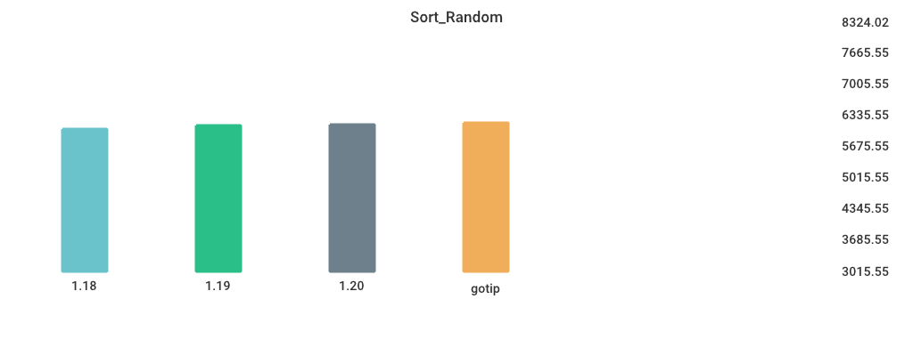

# Benchmarks

## Environment

NumCPU: 2

Arch: amd64

OS: linux

Version: go1.19.5

Itercount: 10

### CPU 0

Model: Intel(R) Xeon(R) CPU E5-2673 v4 @ 2.30GHz

Cores: 1

Mhz: 2294.685000

CacheSize: 51200

Microcode: 0xffffffff

### CPU 1

Model: Intel(R) Xeon(R) CPU E5-2673 v4 @ 2.30GHz

Cores: 1

Mhz: 2294.685000

CacheSize: 51200

Microcode: 0xffffffff

## CGO_CALL_C_FUNC

| Version | Build Time (ms) | Standard Deviation | Run Time (ms) | Standard Deviation |
| ------ | ------ | ------ | ------ | ------ |
| 1.17 | 524.640645 | 29.123625 | 3859.443972 | 50.884082 |
| 1.18 | 499.119656 | 23.495471 | 3641.240298 | 142.889169 |
| 1.19 | 506.410949 | 18.278051 | 3543.941695 | 82.956991 |
| 1.20rc3 | 440.640074 | 13.930851 | 3790.638116 | 99.614137 |
| gotip | 481.016148 | 36.680972 | 3628.605126 | 70.614253 |

## Fibonacci

| Version | Build Time (ms) | Standard Deviation | Run Time (ms) | Standard Deviation |
| ------ | ------ | ------ | ------ | ------ |
| 1.17 | 127.669581 | 4.286166 | 3863.796800 | 43.191662 |
| 1.18 | 128.452461 | 5.088022 | 3864.292375 | 51.456448 |
| 1.19 | 118.308194 | 8.793125 | 3883.828811 | 162.494619 |
| 1.20rc3 | 134.352253 | 6.666895 | 3921.837048 | 56.489359 |
| gotip | 122.706036 | 9.837597 | 4161.329740 | 69.476512 |

## Garbage_Collection

| Version | Build Time (ms) | Standard Deviation | Run Time (ms) | Standard Deviation |
| ------ | ------ | ------ | ------ | ------ |
| 1.17 | 136.290592 | 4.820094 | 6163.353544 | 70.503735 |
| 1.18 | 150.418351 | 9.234960 | 6274.477308 | 132.775237 |
| 1.19 | 120.027226 | 4.605560 | 6204.587457 | 132.930930 |
| 1.20rc3 | 128.729563 | 7.118179 | 6756.220093 | 129.063200 |
| gotip | 121.731301 | 7.623491 | 7251.899224 | 173.484061 |

## Goroutine_Creation

| Version | Build Time (ms) | Standard Deviation | Run Time (ms) | Standard Deviation |
| ------ | ------ | ------ | ------ | ------ |
| 1.17 | 148.953549 | 16.544364 | 5393.377199 | 164.098401 |
| 1.18 | 144.035986 | 7.358638 | 5193.315469 | 59.537619 |
| 1.19 | 123.068072 | 5.899213 | 5307.811464 | 159.110463 |
| 1.20rc3 | 124.703034 | 3.863122 | 5397.634098 | 182.031320 |
| gotip | 127.478060 | 6.808432 | 5526.177617 | 192.518271 |

## MergeSort

| Version | Build Time (ms) | Standard Deviation | Run Time (ms) | Standard Deviation |
| ------ | ------ | ------ | ------ | ------ |
| 1.17 | 139.327201 | 4.877292 | 8089.730174 | 79.295173 |
| 1.18 | 140.477239 | 15.758368 | 6678.555304 | 168.547124 |
| 1.19 | 124.405963 | 5.482412 | 8862.851385 | 92.053068 |
| 1.20rc3 | 132.213805 | 9.231986 | 9863.203631 | 187.199311 |
| gotip | 129.054917 | 4.097316 | 10176.238694 | 141.022930 |

## Sort_Random

| Version | Build Time (ms) | Standard Deviation | Run Time (ms) | Standard Deviation |
| ------ | ------ | ------ | ------ | ------ |
| 1.17 | 152.665866 | 7.342875 | 5422.887377 | 231.690097 |
| 1.18 | 158.323369 | 5.989017 | 4976.101969 | 36.428207 |
| 1.19 | 127.032335 | 5.284029 | 5007.264870 | 69.404904 |
| 1.20rc3 | 139.353438 | 11.383207 | 5057.323087 | 154.029008 |
| gotip | 136.678599 | 11.186895 | 5255.625327 | 139.172536 |

## Sort_Reversed

| Version | Build Time (ms) | Standard Deviation | Run Time (ms) | Standard Deviation |
| ------ | ------ | ------ | ------ | ------ |
| 1.17 | 146.436764 | 5.207931 | 4002.990509 | 182.298914 |
| 1.18 | 149.120520 | 6.452004 | 3842.530676 | 43.542156 |
| 1.19 | 119.580236 | 9.569529 | 382.647608 | 9.370721 |
| 1.20rc3 | 127.428019 | 5.535992 | 427.072197 | 13.575578 |
| gotip | 133.946929 | 7.217349 | 358.749947 | 6.502614 |

## TimeAfterFunc

| Version | Build Time (ms) | Standard Deviation | Run Time (ms) | Standard Deviation |
| ------ | ------ | ------ | ------ | ------ |
| 1.17 | 164.636235 | 34.516511 | 7041.261158 | 739.444210 |
| 1.18 | 174.463219 | 36.172034 | 4713.955266 | 331.923471 |
| 1.19 | 138.547021 | 33.565650 | 4977.957330 | 520.445666 |
| 1.20rc3 | 145.848873 | 11.014651 | 5644.866087 | 573.185311 |
| gotip | 142.790608 | 6.263077 | 5665.372726 | 860.203096 |

## alloc_1.5k

| Version | Build Time (ms) | Standard Deviation | Run Time (ms) | Standard Deviation |
| ------ | ------ | ------ | ------ | ------ |
| 1.17 | 141.792652 | 14.930517 | 3444.468319 | 39.598888 |
| 1.18 | 128.906405 | 6.046561 | 2464.770632 | 37.734318 |
| 1.19 | 125.512776 | 6.015522 | 2339.198202 | 36.855740 |
| 1.20rc3 | 126.542281 | 4.822987 | 2437.893612 | 72.137936 |
| gotip | 128.717052 | 8.266898 | 2375.164804 | 34.016296 |

## regexp_Compile

| Version | Build Time (ms) | Standard Deviation | Run Time (ms) | Standard Deviation |
| ------ | ------ | ------ | ------ | ------ |
| 1.17 | 182.624866 | 9.687176 | 1245.811398 | 18.683616 |
| 1.18 | 176.845711 | 14.968960 | 1266.907687 | 22.031111 |
| 1.19 | 151.976344 | 9.638380 | 1291.424591 | 32.811845 |
| 1.20rc3 | 152.990348 | 7.810990 | 1229.975904 | 24.634151 |
| gotip | 144.617074 | 7.410776 | 1178.788921 | 7.863510 |

## regexp_FindAllString

| Version | Build Time (ms) | Standard Deviation | Run Time (ms) | Standard Deviation |
| ------ | ------ | ------ | ------ | ------ |
| 1.17 | 179.078860 | 11.239367 | 2634.605595 | 45.052068 |
| 1.18 | 184.835888 | 9.246088 | 2762.192613 | 20.409737 |
| 1.19 | 164.401543 | 4.199677 | 2448.604063 | 98.289411 |
| 1.20rc3 | 158.834757 | 15.907582 | 2564.771951 | 115.979941 |
| gotip | 153.739717 | 9.267098 | 2322.894052 | 103.341121 |

## switch_case

| Version | Build Time (ms) | Standard Deviation | Run Time (ms) | Standard Deviation |
| ------ | ------ | ------ | ------ | ------ |
| 1.17 | 213.890378 | 11.869250 | 5965.282580 | 216.200690 |
| 1.18 | 217.808388 | 25.581564 | 5949.045582 | 61.625048 |
| 1.19 | 170.737534 | 11.995295 | 3472.527113 | 127.174327 |
| 1.20rc3 | 184.636021 | 5.489699 | 3226.360523 | 67.020842 |
| gotip | 173.389872 | 7.951104 | 3046.691784 | 115.215377 |

