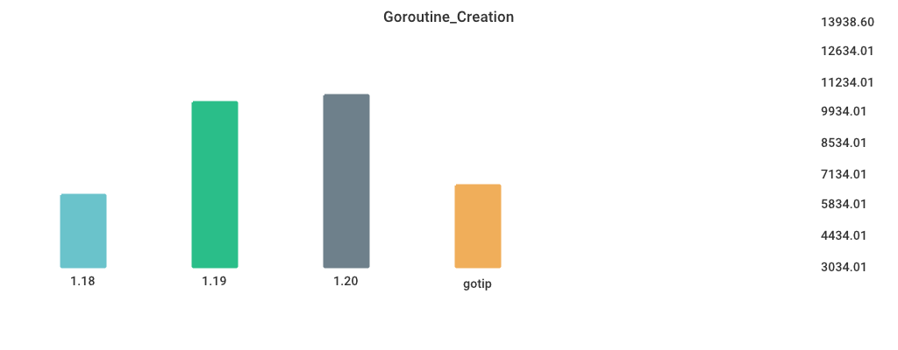

# Benchmarks

## Environment

NumCPU: 2

Arch: amd64

OS: linux

Version: go1.18.4

Itercount: 10

### CPU 0

Model: Intel(R) Xeon(R) Platinum 8272CL CPU @ 2.60GHz

Cores: 1

Mhz: 2593.906000

CacheSize: 36608

Microcode: 0xffffffff

### CPU 1

Model: Intel(R) Xeon(R) Platinum 8272CL CPU @ 2.60GHz

Cores: 1

Mhz: 2593.906000

CacheSize: 36608

Microcode: 0xffffffff

## Fibonacci

| Version | Build Time (ms) | Standard Deviation | Run Time (ms) | Standard Deviation |
| ------ | ------ | ------ | ------ | ------ |
| 1.17 | 130.832498 | 2.506057 | 3902.379125 | 1.140802 |
| 1.18 | 138.295898 | 2.577648 | 4012.997357 | 1.865058 |
| 1.19 | 153.998082 | 6.290031 | 3904.912531 | 5.025365 |
| gotip | 148.653404 | 2.621167 | 3903.630884 | 1.703657 |

## Garbage_Collection

| Version | Build Time (ms) | Standard Deviation | Run Time (ms) | Standard Deviation |
| ------ | ------ | ------ | ------ | ------ |
| 1.17 | 139.278617 | 4.074691 | 5685.119357 | 52.098432 |
| 1.18 | 146.209714 | 2.766500 | 5706.162356 | 33.461614 |
| 1.19 | 149.412675 | 1.924249 | 5538.293574 | 33.287018 |
| gotip | 149.848838 | 5.016793 | 5558.673964 | 21.387290 |

## Goroutine_Creation

| Version | Build Time (ms) | Standard Deviation | Run Time (ms) | Standard Deviation |
| ------ | ------ | ------ | ------ | ------ |
| 1.17 | 144.897053 | 9.310907 | 9178.059659 | 96.487698 |
| 1.18 | 150.886013 | 3.682742 | 5598.621667 | 80.044869 |
| 1.19 | 153.579314 | 3.444160 | 9109.438417 | 33.354565 |
| gotip | 152.145527 | 4.338443 | 9050.873818 | 24.139415 |

## MergeSort

| Version | Build Time (ms) | Standard Deviation | Run Time (ms) | Standard Deviation |
| ------ | ------ | ------ | ------ | ------ |
| 1.17 | 140.593503 | 8.777576 | 6080.526343 | 50.188464 |
| 1.18 | 142.782841 | 2.667382 | 5994.505506 | 58.316515 |
| 1.19 | 154.850569 | 2.527524 | 7627.362538 | 36.084965 |
| gotip | 154.335209 | 3.977023 | 7710.873595 | 37.345800 |

## Sort_Random

| Version | Build Time (ms) | Standard Deviation | Run Time (ms) | Standard Deviation |
| ------ | ------ | ------ | ------ | ------ |
| 1.17 | 156.185107 | 3.388346 | 5012.998673 | 1.126870 |
| 1.18 | 161.048000 | 5.856477 | 5028.818449 | 4.169876 |
| 1.19 | 161.124040 | 2.597653 | 5081.440574 | 4.508070 |
| gotip | 160.692103 | 4.209138 | 5077.485817 | 1.362701 |

## Sort_Reversed

| Version | Build Time (ms) | Standard Deviation | Run Time (ms) | Standard Deviation |
| ------ | ------ | ------ | ------ | ------ |
| 1.17 | 140.925173 | 4.545779 | 3710.857961 | 1.788344 |
| 1.18 | 149.659481 | 4.856278 | 3575.669074 | 1.414948 |
| 1.19 | 153.742772 | 2.398313 | 369.668597 | 0.453117 |
| gotip | 154.905037 | 3.094302 | 370.142016 | 0.542734 |

## TimeAfterFunc

| Version | Build Time (ms) | Standard Deviation | Run Time (ms) | Standard Deviation |
| ------ | ------ | ------ | ------ | ------ |
| 1.17 | 156.946486 | 22.858502 | 4766.719490 | 713.115927 |
| 1.18 | 164.121157 | 91.842214 | 4417.327091 | 675.884076 |
| 1.19 | 165.896131 | 64.605786 | 4848.383885 | 506.600515 |
| gotip | 166.814454 | 59.447861 | 4823.238372 | 312.055441 |

## alloc_1.5k

| Version | Build Time (ms) | Standard Deviation | Run Time (ms) | Standard Deviation |
| ------ | ------ | ------ | ------ | ------ |
| 1.17 | 134.081828 | 89.286795 | 3177.555430 | 16.153716 |
| 1.18 | 139.768190 | 2.808866 | 4347.151427 | 2.179848 |
| 1.19 | 149.921499 | 2.508307 | 2191.616440 | 0.949265 |
| gotip | 149.636669 | 1.945895 | 2190.982667 | 0.776814 |

## regexp_Compile

| Version | Build Time (ms) | Standard Deviation | Run Time (ms) | Standard Deviation |
| ------ | ------ | ------ | ------ | ------ |
| 1.17 | 173.133181 | 16.837395 | 1097.197583 | 4.604102 |
| 1.18 | 175.513125 | 12.850548 | 1150.848977 | 5.731293 |
| 1.19 | 178.838541 | 5.355847 | 1170.659226 | 5.291808 |
| gotip | 179.515504 | 9.541810 | 1177.658862 | 8.062682 |

## regexp_FindAllString

| Version | Build Time (ms) | Standard Deviation | Run Time (ms) | Standard Deviation |
| ------ | ------ | ------ | ------ | ------ |
| 1.17 | 178.020274 | 2.035660 | 2375.350344 | 4.050572 |
| 1.18 | 182.414913 | 3.217126 | 2378.353988 | 7.519325 |
| 1.19 | 185.521601 | 10.791731 | 2256.764469 | 9.833363 |
| gotip | 184.767512 | 1.702220 | 2266.206747 | 6.860484 |

## switch_case

| Version | Build Time (ms) | Standard Deviation | Run Time (ms) | Standard Deviation |
| ------ | ------ | ------ | ------ | ------ |
| 1.17 | 208.955799 | 26.925309 | 5205.961381 | 4.183790 |
| 1.18 | 209.888062 | 18.024333 | 5724.814028 | 2.437471 |
| 1.19 | 215.893331 | 7.847708 | 3222.775107 | 1.567469 |
| gotip | 216.346620 | 11.533408 | 3223.533709 | 1.303934 |

