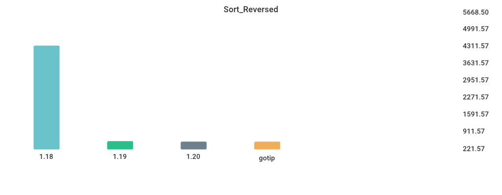

# Benchmarks

## Environment

NumCPU: 2

Arch: amd64

OS: linux

Version: go1.19.7

Itercount: 10

### CPU 0

Model: Intel(R) Xeon(R) CPU E5-2673 v3 @ 2.40GHz

Cores: 1

Mhz: 2397.220000

CacheSize: 30720

Microcode: 0xffffffff

### CPU 1

Model: Intel(R) Xeon(R) CPU E5-2673 v3 @ 2.40GHz

Cores: 1

Mhz: 2397.220000

CacheSize: 30720

Microcode: 0xffffffff

## CGO_CALL_C_FUNC

| Version | Build Time (ms) | Standard Deviation | Run Time (ms) | Standard Deviation |
| ------ | ------ | ------ | ------ | ------ |
| 1.18 | 529.846082 | 17.788980 | 3845.837406 | 54.055192 |
| 1.19 | 590.759425 | 22.729040 | 4023.531447 | 153.718833 |
| 1.20 | 457.560921 | 27.115922 | 3910.173358 | 81.881942 |
| gotip | 528.893102 | 22.113585 | 4087.342357 | 135.854089 |

## Fibonacci

| Version | Build Time (ms) | Standard Deviation | Run Time (ms) | Standard Deviation |
| ------ | ------ | ------ | ------ | ------ |
| 1.18 | 133.492529 | 10.077109 | 4449.564947 | 142.203447 |
| 1.19 | 140.741351 | 7.369075 | 4584.892074 | 178.610490 |
| 1.20 | 136.764873 | 7.409069 | 4787.705165 | 122.408522 |
| gotip | 130.805612 | 7.284143 | 4474.895701 | 96.816677 |

## Garbage_Collection

| Version | Build Time (ms) | Standard Deviation | Run Time (ms) | Standard Deviation |
| ------ | ------ | ------ | ------ | ------ |
| 1.18 | 144.581419 | 16.062388 | 6436.988121 | 59.213321 |
| 1.19 | 123.963439 | 7.452872 | 6351.496703 | 70.019897 |
| 1.20 | 130.944995 | 8.127153 | 7388.343576 | 275.607130 |
| gotip | 139.377626 | 5.951175 | 7472.913134 | 208.850863 |

## Goroutine_Creation

| Version | Build Time (ms) | Standard Deviation | Run Time (ms) | Standard Deviation |
| ------ | ------ | ------ | ------ | ------ |
| 1.18 | 155.689499 | 6.965903 | 6179.415097 | 35.045401 |
| 1.19 | 133.524454 | 5.420498 | 6305.450279 | 100.573969 |
| 1.20 | 145.985490 | 15.127519 | 6305.243289 | 147.085973 |
| gotip | 134.796986 | 9.123921 | 6082.440042 | 298.973421 |

## MergeSort

| Version | Build Time (ms) | Standard Deviation | Run Time (ms) | Standard Deviation |
| ------ | ------ | ------ | ------ | ------ |
| 1.18 | 138.919536 | 6.815158 | 6709.898196 | 85.892886 |
| 1.19 | 128.892760 | 7.280187 | 8640.658715 | 215.904199 |
| 1.20 | 142.863361 | 5.318725 | 10055.385668 | 275.303748 |
| gotip | 137.115447 | 9.588524 | 10051.922017 | 440.248899 |

## Sort_Random

| Version | Build Time (ms) | Standard Deviation | Run Time (ms) | Standard Deviation |
| ------ | ------ | ------ | ------ | ------ |
| 1.18 | 165.731129 | 19.069004 | 5703.312939 | 167.997736 |
| 1.19 | 132.484556 | 5.203577 | 5550.525948 | 199.644498 |
| 1.20 | 150.783697 | 6.096040 | 5594.491042 | 139.396629 |
| gotip | 152.119740 | 9.341347 | 6133.216081 | 93.443589 |

## Sort_Reversed

| Version | Build Time (ms) | Standard Deviation | Run Time (ms) | Standard Deviation |
| ------ | ------ | ------ | ------ | ------ |
| 1.18 | 157.326638 | 10.096780 | 4411.570801 | 40.395857 |
| 1.19 | 136.588904 | 5.719552 | 441.272183 | 8.614347 |
| 1.20 | 140.733872 | 7.277641 | 403.818870 | 6.286593 |
| gotip | 138.109674 | 9.537164 | 398.443157 | 9.893061 |

## TimeAfterFunc

| Version | Build Time (ms) | Standard Deviation | Run Time (ms) | Standard Deviation |
| ------ | ------ | ------ | ------ | ------ |
| 1.18 | 170.654454 | 10.616797 | 4251.103394 | 718.218877 |
| 1.19 | 145.269231 | 7.549196 | 4715.977544 | 322.859087 |
| 1.20 | 150.904441 | 6.027543 | 5458.602277 | 1181.537900 |
| gotip | 159.503246 | 7.295856 | 5514.075925 | 991.786271 |

## alloc_1.5k

| Version | Build Time (ms) | Standard Deviation | Run Time (ms) | Standard Deviation |
| ------ | ------ | ------ | ------ | ------ |
| 1.18 | 143.052637 | 21.697730 | 2924.535533 | 55.805163 |
| 1.19 | 133.753529 | 29.867246 | 2807.361055 | 120.978072 |
| 1.20 | 136.756905 | 5.916692 | 2765.821561 | 38.128592 |
| gotip | 139.765927 | 5.429935 | 2847.795654 | 139.765098 |

## regexp_Compile

| Version | Build Time (ms) | Standard Deviation | Run Time (ms) | Standard Deviation |
| ------ | ------ | ------ | ------ | ------ |
| 1.18 | 180.898141 | 10.459001 | 1342.872848 | 37.148853 |
| 1.19 | 156.248553 | 9.985761 | 1331.453302 | 25.152150 |
| 1.20 | 158.978771 | 12.016152 | 1441.695994 | 22.060853 |
| gotip | 156.928899 | 14.492622 | 1261.757274 | 19.873399 |

## regexp_FindAllString

| Version | Build Time (ms) | Standard Deviation | Run Time (ms) | Standard Deviation |
| ------ | ------ | ------ | ------ | ------ |
| 1.18 | 192.685249 | 9.951765 | 2816.477375 | 56.176407 |
| 1.19 | 153.753939 | 7.064618 | 2608.030042 | 67.917741 |
| 1.20 | 168.450425 | 9.559422 | 2790.759761 | 33.895597 |
| gotip | 178.887685 | 11.332838 | 2494.279190 | 31.780568 |

## switch_case

| Version | Build Time (ms) | Standard Deviation | Run Time (ms) | Standard Deviation |
| ------ | ------ | ------ | ------ | ------ |
| 1.18 | 229.468219 | 10.258190 | 6326.693715 | 69.045948 |
| 1.19 | 186.865227 | 19.542351 | 3682.624746 | 52.993917 |
| 1.20 | 204.272005 | 9.446495 | 3655.667485 | 27.505293 |
| gotip | 202.266820 | 6.553085 | 3276.611373 | 85.763387 |

