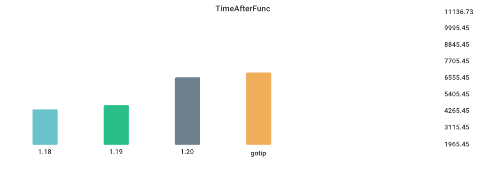

# Benchmarks

## Environment

NumCPU: 2

Arch: amd64

OS: linux

Version: go1.18.3

Itercount: 10

### CPU 0

Model: Intel(R) Xeon(R) Platinum 8272CL CPU @ 2.60GHz

Cores: 1

Mhz: 2593.907000

CacheSize: 36608

Microcode: 0xffffffff

### CPU 1

Model: Intel(R) Xeon(R) Platinum 8272CL CPU @ 2.60GHz

Cores: 1

Mhz: 2593.907000

CacheSize: 36608

Microcode: 0xffffffff

## alloc_1.5k

| Version | Build Time (ms) | Standard Deviation | Run Time (ms) | Standard Deviation |
| ------ | ------ | ------ | ------ | ------ |
| 1.17 | 125.399777 | 4.031667 | 3202.769028 | 18.535102 |
| 1.18 | 137.959499 | 3.247444 | 4347.102549 | 10.329353 |
| 1.19beta1 | 278.850183 | 5.161591 | 4347.890948 | 2.067358 |
| 1.19rc1 | 155.935808 | 3.629742 | 2191.895180 | 1.040585 |
| gotip | 157.602887 | 1.490458 | 2190.813543 | 1.676569 |

## Fibonacci

| Version | Build Time (ms) | Standard Deviation | Run Time (ms) | Standard Deviation |
| ------ | ------ | ------ | ------ | ------ |
| 1.17 | 125.334378 | 2.825433 | 3901.135518 | 1.421950 |
| 1.18 | 132.940086 | 7.563077 | 4012.532517 | 3.373611 |
| 1.19beta1 | 276.674243 | 4.310931 | 4012.938135 | 4.717566 |
| 1.19rc1 | 153.199054 | 3.224954 | 3900.977283 | 0.893398 |
| gotip | 155.030317 | 1.929049 | 3904.385286 | 0.757948 |

## regexp_FindAllString

| Version | Build Time (ms) | Standard Deviation | Run Time (ms) | Standard Deviation |
| ------ | ------ | ------ | ------ | ------ |
| 1.17 | 166.358351 | 3.870520 | 2371.622537 | 11.678614 |
| 1.18 | 181.302211 | 5.894185 | 2388.140787 | 17.055134 |
| 1.19beta1 | 323.251190 | 6.976046 | 2263.323302 | 11.495371 |
| 1.19rc1 | 194.239034 | 3.878089 | 2253.721797 | 10.088231 |
| gotip | 199.686416 | 5.332808 | 2261.399168 | 15.396090 |

## Sort_Reversed

| Version | Build Time (ms) | Standard Deviation | Run Time (ms) | Standard Deviation |
| ------ | ------ | ------ | ------ | ------ |
| 1.17 | 135.268926 | 3.145185 | 3711.377849 | 4.878023 |
| 1.18 | 145.457010 | 3.426424 | 3574.788884 | 2.897981 |
| 1.19beta1 | 290.102578 | 25.458946 | 369.875074 | 0.622284 |
| 1.19rc1 | 158.745528 | 2.946436 | 369.785867 | 1.524439 |
| gotip | 160.271553 | 3.179061 | 369.765327 | 3.725235 |

## switch_case

| Version | Build Time (ms) | Standard Deviation | Run Time (ms) | Standard Deviation |
| ------ | ------ | ------ | ------ | ------ |
| 1.17 | 197.168108 | 7.588427 | 5206.868455 | 5.390869 |
| 1.18 | 204.779075 | 12.840938 | 5722.902203 | 2.876748 |
| 1.19beta1 | 346.707425 | 8.521633 | 3272.596231 | 3.057897 |
| 1.19rc1 | 230.453564 | 15.489278 | 3222.317799 | 11.516199 |
| gotip | 234.077787 | 3.240193 | 3222.718171 | 1.798447 |

## TimeAfterFunc

| Version | Build Time (ms) | Standard Deviation | Run Time (ms) | Standard Deviation |
| ------ | ------ | ------ | ------ | ------ |
| 1.17 | 148.030978 | 7.096296 | 5180.168541 | 390.234983 |
| 1.18 | 161.550717 | 78.193168 | 4573.139367 | 802.953240 |
| 1.19beta1 | 295.353046 | 315.110671 | 5004.088134 | 536.647179 |
| 1.19rc1 | 173.906130 | 83.929381 | 4751.720364 | 371.526081 |
| gotip | 180.571742 | 3.542396 | 4800.319491 | 352.331371 |

## MergeSort

| Version | Build Time (ms) | Standard Deviation | Run Time (ms) | Standard Deviation |
| ------ | ------ | ------ | ------ | ------ |
| 1.17 | 130.873332 | 6.054841 | 6115.613143 | 57.510144 |
| 1.18 | 136.979419 | 2.616462 | 5854.727436 | 35.677391 |
| 1.19beta1 | 280.710482 | 2.470892 | 7319.782175 | 79.366832 |
| 1.19rc1 | 155.350354 | 13.418515 | 7296.494839 | 20.709849 |
| gotip | 163.933865 | 3.901531 | 7635.419126 | 91.025249 |

## regexp_Compile

| Version | Build Time (ms) | Standard Deviation | Run Time (ms) | Standard Deviation |
| ------ | ------ | ------ | ------ | ------ |
| 1.17 | 162.435790 | 10.424638 | 1097.417049 | 12.557147 |
| 1.18 | 176.272379 | 11.603255 | 1154.448064 | 5.299320 |
| 1.19beta1 | 310.639673 | 5.999055 | 1162.547742 | 10.830214 |
| 1.19rc1 | 188.248035 | 6.436523 | 1171.468305 | 11.482760 |
| gotip | 198.151251 | 3.301744 | 1179.755320 | 19.022420 |

## Sort_Random

| Version | Build Time (ms) | Standard Deviation | Run Time (ms) | Standard Deviation |
| ------ | ------ | ------ | ------ | ------ |
| 1.17 | 150.206390 | 3.036906 | 5012.136056 | 4.344017 |
| 1.18 | 156.447231 | 4.958600 | 5028.748244 | 3.232339 |
| 1.19beta1 | 298.955266 | 3.018388 | 5022.096699 | 3.609287 |
| 1.19rc1 | 167.483135 | 3.936684 | 5095.375676 | 3.650033 |
| gotip | 170.869146 | 2.505621 | 5063.014299 | 1.822729 |

