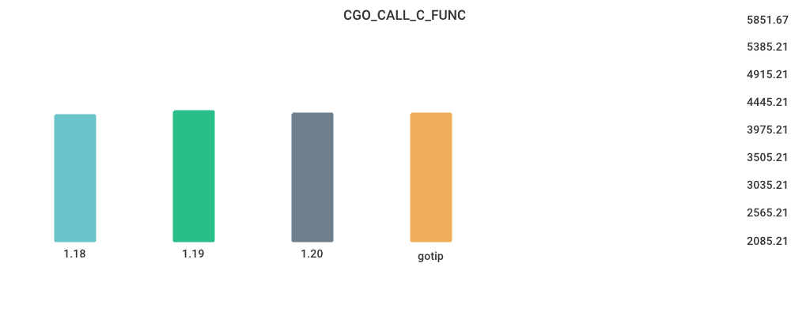
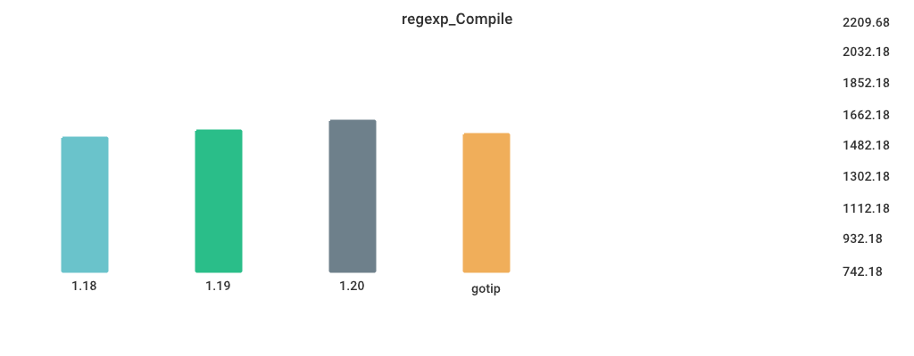

# Benchmarks

## Environment

NumCPU: 2

Arch: amd64

OS: linux

Version: go1.19.3

Itercount: 10

### CPU 0

Model: Intel(R) Xeon(R) Platinum 8272CL CPU @ 2.60GHz

Cores: 1

Mhz: 2593.905000

CacheSize: 36608

Microcode: 0xffffffff

### CPU 1

Model: Intel(R) Xeon(R) Platinum 8272CL CPU @ 2.60GHz

Cores: 1

Mhz: 2593.905000

CacheSize: 36608

Microcode: 0xffffffff

## CGO_CALL_C_FUNC

| Version | Build Time (ms) | Standard Deviation | Run Time (ms) | Standard Deviation |
| ------ | ------ | ------ | ------ | ------ |
| 1.17 | 477.509224 | 28.881217 | 3860.918364 | 64.981221 |
| 1.18 | 486.111294 | 13.223767 | 3516.980745 | 2.008013 |
| 1.19 | 535.717343 | 13.680368 | 3541.831710 | 1.755310 |
| gotip | 4064.505568 | 27.667904 | 3555.967148 | 1.401891 |

## Fibonacci

| Version | Build Time (ms) | Standard Deviation | Run Time (ms) | Standard Deviation |
| ------ | ------ | ------ | ------ | ------ |
| 1.17 | 130.975439 | 3.386796 | 3903.194820 | 8.408346 |
| 1.18 | 134.591261 | 6.352866 | 4013.485433 | 1.850283 |
| 1.19 | 145.107073 | 2.362499 | 3901.644129 | 4.474748 |
| gotip | 2927.333397 | 23.057676 | 3904.078377 | 4.104222 |

## Garbage_Collection

| Version | Build Time (ms) | Standard Deviation | Run Time (ms) | Standard Deviation |
| ------ | ------ | ------ | ------ | ------ |
| 1.17 | 143.297011 | 5.448525 | 5694.369636 | 35.972328 |
| 1.18 | 148.070465 | 4.461411 | 5712.511639 | 26.475384 |
| 1.19 | 146.464777 | 4.920105 | 5544.343870 | 36.268223 |
| gotip | 2965.511757 | 57.439152 | 6200.105833 | 21.510533 |

## Goroutine_Creation

| Version | Build Time (ms) | Standard Deviation | Run Time (ms) | Standard Deviation |
| ------ | ------ | ------ | ------ | ------ |
| 1.17 | 148.628544 | 4.533029 | 9048.200924 | 38.170258 |
| 1.18 | 150.626029 | 3.321952 | 5274.761063 | 67.503894 |
| 1.19 | 150.008654 | 3.497296 | 8906.755444 | 37.015395 |
| gotip | 3041.693606 | 183.256024 | 8946.728242 | 65.736463 |

## MergeSort

| Version | Build Time (ms) | Standard Deviation | Run Time (ms) | Standard Deviation |
| ------ | ------ | ------ | ------ | ------ |
| 1.17 | 139.134792 | 3.650917 | 6692.744152 | 114.819703 |
| 1.18 | 143.007517 | 4.042193 | 5904.816246 | 63.725332 |
| 1.19 | 152.414101 | 6.764418 | 7407.914426 | 44.108988 |
| gotip | 2884.418786 | 41.834172 | 8814.938884 | 130.467442 |

## Sort_Random

| Version | Build Time (ms) | Standard Deviation | Run Time (ms) | Standard Deviation |
| ------ | ------ | ------ | ------ | ------ |
| 1.17 | 161.968918 | 5.218208 | 5012.019713 | 0.634743 |
| 1.18 | 168.934757 | 5.040696 | 5030.894261 | 4.323047 |
| 1.19 | 168.233284 | 3.310057 | 5085.636188 | 4.055662 |
| gotip | 3434.005879 | 89.829948 | 5081.116964 | 3.566921 |

## Sort_Reversed

| Version | Build Time (ms) | Standard Deviation | Run Time (ms) | Standard Deviation |
| ------ | ------ | ------ | ------ | ------ |
| 1.17 | 147.073731 | 3.261407 | 3712.156719 | 1.630911 |
| 1.18 | 152.667100 | 3.025065 | 3575.341742 | 1.093939 |
| 1.19 | 148.902215 | 4.364299 | 370.058043 | 0.732981 |
| gotip | 3200.471695 | 34.552098 | 369.996488 | 0.499689 |

## TimeAfterFunc

| Version | Build Time (ms) | Standard Deviation | Run Time (ms) | Standard Deviation |
| ------ | ------ | ------ | ------ | ------ |
| 1.17 | 159.455630 | 87.723175 | 5322.330915 | 562.815441 |
| 1.18 | 163.919464 | 104.443493 | 4382.854537 | 485.606371 |
| 1.19 | 166.706968 | 6.159132 | 5021.054240 | 501.436235 |
| gotip | 3896.595305 | 104.583144 | 5540.318207 | 512.863285 |

## alloc_1.5k

| Version | Build Time (ms) | Standard Deviation | Run Time (ms) | Standard Deviation |
| ------ | ------ | ------ | ------ | ------ |
| 1.17 | 137.576032 | 78.392003 | 3189.580844 | 24.574668 |
| 1.18 | 140.253817 | 3.366530 | 4346.685645 | 2.188874 |
| 1.19 | 147.039220 | 7.086881 | 2191.870518 | 1.192373 |
| gotip | 2872.543134 | 25.223393 | 2191.266955 | 0.756747 |

## regexp_Compile

| Version | Build Time (ms) | Standard Deviation | Run Time (ms) | Standard Deviation |
| ------ | ------ | ------ | ------ | ------ |
| 1.17 | 170.790886 | 19.099246 | 1093.175459 | 10.167740 |
| 1.18 | 183.841028 | 12.426885 | 1145.222409 | 11.224439 |
| 1.19 | 175.512354 | 14.969373 | 1163.041063 | 11.848912 |
| gotip | 4062.889038 | 46.150051 | 1158.987897 | 9.069233 |

## regexp_FindAllString

| Version | Build Time (ms) | Standard Deviation | Run Time (ms) | Standard Deviation |
| ------ | ------ | ------ | ------ | ------ |
| 1.17 | 177.886170 | 3.173585 | 2352.029011 | 6.749078 |
| 1.18 | 180.651885 | 3.078533 | 2360.386260 | 6.537912 |
| 1.19 | 179.768524 | 3.161889 | 2239.531872 | 12.154464 |
| gotip | 4073.444607 | 28.240523 | 2224.277069 | 14.320346 |

## switch_case

| Version | Build Time (ms) | Standard Deviation | Run Time (ms) | Standard Deviation |
| ------ | ------ | ------ | ------ | ------ |
| 1.17 | 205.387197 | 23.376358 | 5208.246723 | 2.237761 |
| 1.18 | 209.107510 | 17.590987 | 5722.667030 | 0.844421 |
| 1.19 | 210.883678 | 20.471745 | 3223.123112 | 0.987598 |
| gotip | 5353.304554 | 43.174414 | 3224.087664 | 1.629630 |

