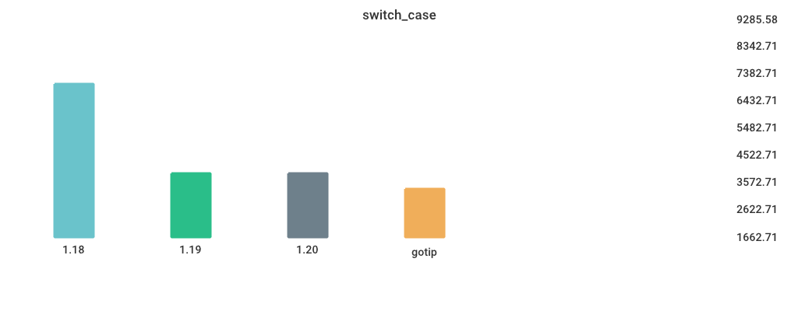

# Benchmarks

## Environment

NumCPU: 2

Arch: amd64

OS: linux

Version: go1.18.3

Itercount: 10

### CPU 0

Model: Intel(R) Xeon(R) Platinum 8171M CPU @ 2.60GHz

Cores: 1

Mhz: 2095.227000

CacheSize: 36608

Microcode: 0xffffffff

### CPU 1

Model: Intel(R) Xeon(R) Platinum 8171M CPU @ 2.60GHz

Cores: 1

Mhz: 2095.227000

CacheSize: 36608

Microcode: 0xffffffff

## Fibonacci

| Version | Build Time (ms) | Standard Deviation | Run Time (ms) | Standard Deviation |
| ------ | ------ | ------ | ------ | ------ |
| 1.17 | 152.678935 | 7.459780 | 4592.769618 | 58.409872 |
| 1.18 | 155.080559 | 4.134661 | 4673.024130 | 48.727869 |
| 1.19beta1 | 330.902362 | 8.132710 | 4788.263170 | 31.898903 |
| 1.19rc1 | 189.326156 | 9.960731 | 4595.957167 | 39.927369 |
| gotip | 180.941369 | 6.810167 | 4555.753002 | 19.359431 |

## MergeSort

| Version | Build Time (ms) | Standard Deviation | Run Time (ms) | Standard Deviation |
| ------ | ------ | ------ | ------ | ------ |
| 1.17 | 154.732392 | 7.976884 | 7083.708194 | 40.873972 |
| 1.18 | 162.981606 | 5.127549 | 6715.225223 | 56.311154 |
| 1.19beta1 | 336.945274 | 4.932207 | 8468.730895 | 157.540949 |
| 1.19rc1 | 192.655539 | 5.091409 | 8627.751495 | 129.529252 |
| gotip | 230.702054 | 19.923323 | 8810.949200 | 73.138972 |

## regexp_FindAllString

| Version | Build Time (ms) | Standard Deviation | Run Time (ms) | Standard Deviation |
| ------ | ------ | ------ | ------ | ------ |
| 1.17 | 203.434209 | 4.851295 | 2900.304245 | 32.410375 |
| 1.18 | 223.216873 | 9.623180 | 2985.204649 | 16.909539 |
| 1.19beta1 | 397.078940 | 8.739727 | 2882.554606 | 34.165673 |
| 1.19rc1 | 249.680091 | 10.645148 | 2846.280305 | 53.559176 |
| gotip | 238.874669 | 9.447579 | 2847.925799 | 34.195348 |

## Sort_Reversed

| Version | Build Time (ms) | Standard Deviation | Run Time (ms) | Standard Deviation |
| ------ | ------ | ------ | ------ | ------ |
| 1.17 | 169.666060 | 7.381679 | 4439.975465 | 14.589377 |
| 1.18 | 177.892381 | 3.582697 | 4274.655402 | 11.301378 |
| 1.19beta1 | 352.288538 | 11.049078 | 446.348230 | 16.503724 |
| 1.19rc1 | 189.876825 | 8.390245 | 444.645783 | 18.455261 |
| gotip | 191.022548 | 7.173494 | 441.310529 | 9.451042 |

## switch_case

| Version | Build Time (ms) | Standard Deviation | Run Time (ms) | Standard Deviation |
| ------ | ------ | ------ | ------ | ------ |
| 1.17 | 241.854451 | 13.014625 | 6244.280705 | 121.865084 |
| 1.18 | 259.296815 | 20.012782 | 6852.879685 | 24.833845 |
| 1.19beta1 | 421.776022 | 18.239177 | 3920.052280 | 16.837080 |
| 1.19rc1 | 282.284286 | 14.796405 | 3854.723499 | 27.358593 |
| gotip | 286.490788 | 11.100457 | 3853.911458 | 99.379854 |

## TimeAfterFunc

| Version | Build Time (ms) | Standard Deviation | Run Time (ms) | Standard Deviation |
| ------ | ------ | ------ | ------ | ------ |
| 1.17 | 183.883852 | 11.865171 | 6943.166412 | 1008.433877 |
| 1.18 | 196.612716 | 119.269507 | 4416.815003 | 709.851991 |
| 1.19beta1 | 363.630352 | 398.643262 | 4949.876694 | 318.718646 |
| 1.19rc1 | 211.977219 | 17.322048 | 5084.116826 | 597.210280 |
| gotip | 215.096531 | 8.678522 | 4784.673630 | 544.850733 |

## alloc_1.5k

| Version | Build Time (ms) | Standard Deviation | Run Time (ms) | Standard Deviation |
| ------ | ------ | ------ | ------ | ------ |
| 1.17 | 151.376528 | 11.902851 | 3844.187687 | 79.151402 |
| 1.18 | 158.519504 | 5.155472 | 5210.395237 | 72.024780 |
| 1.19beta1 | 338.448502 | 9.878433 | 5194.465977 | 28.778531 |
| 1.19rc1 | 186.613210 | 7.714966 | 2600.350545 | 13.549532 |
| gotip | 191.089212 | 8.406696 | 2620.455369 | 58.243504 |

## regexp_Compile

| Version | Build Time (ms) | Standard Deviation | Run Time (ms) | Standard Deviation |
| ------ | ------ | ------ | ------ | ------ |
| 1.17 | 194.797126 | 7.288241 | 1380.637613 | 16.865744 |
| 1.18 | 210.688455 | 13.987961 | 1435.069788 | 18.580417 |
| 1.19beta1 | 386.292711 | 9.963677 | 1453.902403 | 27.240561 |
| 1.19rc1 | 233.205840 | 4.071675 | 1446.970609 | 19.281747 |
| gotip | 237.660019 | 5.378830 | 1479.853304 | 41.614047 |

## Sort_Random

| Version | Build Time (ms) | Standard Deviation | Run Time (ms) | Standard Deviation |
| ------ | ------ | ------ | ------ | ------ |
| 1.17 | 178.547151 | 6.012688 | 6006.297523 | 154.283278 |
| 1.18 | 188.473963 | 6.470465 | 6016.672788 | 57.306379 |
| 1.19beta1 | 373.651381 | 9.733072 | 6032.430974 | 60.256254 |
| 1.19rc1 | 209.311728 | 4.622948 | 6103.469361 | 5.098957 |
| gotip | 208.230806 | 9.472016 | 6092.110045 | 109.342977 |

