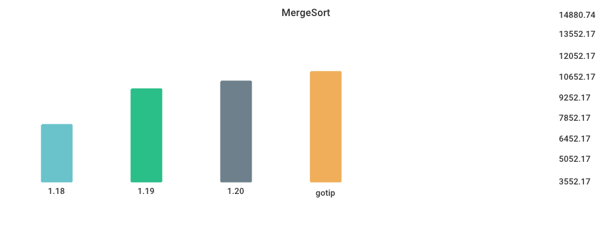

# Benchmarks

## Environment

NumCPU: 2

Arch: amd64

OS: linux

Version: go1.19.4

Itercount: 10

### CPU 0

Model: Intel(R) Xeon(R) Platinum 8272CL CPU @ 2.60GHz

Cores: 1

Mhz: 2593.908000

CacheSize: 36608

Microcode: 0xffffffff

### CPU 1

Model: Intel(R) Xeon(R) Platinum 8272CL CPU @ 2.60GHz

Cores: 1

Mhz: 2593.908000

CacheSize: 36608

Microcode: 0xffffffff

## CGO_CALL_C_FUNC

| Version | Build Time (ms) | Standard Deviation | Run Time (ms) | Standard Deviation |
| ------ | ------ | ------ | ------ | ------ |
| 1.17 | 482.011183 | 12.574005 | 3871.780212 | 6.198173 |
| 1.18 | 499.028326 | 10.367536 | 3517.507887 | 3.710886 |
| 1.19 | 532.950055 | 5.930443 | 3542.625279 | 1.229508 |
| 1.20rc1 | 4038.062565 | 63.620076 | 3554.916150 | 1.353762 |
| gotip | 3983.608442 | 30.565630 | 3556.619907 | 1.820847 |

## Fibonacci

| Version | Build Time (ms) | Standard Deviation | Run Time (ms) | Standard Deviation |
| ------ | ------ | ------ | ------ | ------ |
| 1.17 | 129.174655 | 5.366245 | 3902.481297 | 1.178039 |
| 1.18 | 133.718596 | 4.530968 | 4012.918723 | 2.133769 |
| 1.19 | 148.957096 | 2.755151 | 3902.859694 | 1.255034 |
| 1.20rc1 | 2821.400983 | 26.730820 | 3904.899583 | 6.136212 |
| gotip | 2799.991612 | 34.962772 | 3902.011498 | 5.692943 |

## Garbage_Collection

| Version | Build Time (ms) | Standard Deviation | Run Time (ms) | Standard Deviation |
| ------ | ------ | ------ | ------ | ------ |
| 1.17 | 140.411985 | 20.418533 | 5681.527937 | 48.425261 |
| 1.18 | 141.770505 | 4.538692 | 5698.995398 | 137.070158 |
| 1.19 | 143.383459 | 3.510051 | 5573.542776 | 21.431452 |
| 1.20rc1 | 2822.653015 | 31.054614 | 6215.298521 | 19.205095 |
| gotip | 2856.060220 | 48.969391 | 6220.862731 | 19.849499 |

## Goroutine_Creation

| Version | Build Time (ms) | Standard Deviation | Run Time (ms) | Standard Deviation |
| ------ | ------ | ------ | ------ | ------ |
| 1.17 | 143.673402 | 16.360431 | 8878.072870 | 64.084331 |
| 1.18 | 146.365947 | 3.466368 | 5163.286021 | 35.711333 |
| 1.19 | 150.541822 | 5.128457 | 8778.139847 | 15.363600 |
| 1.20rc1 | 2939.863548 | 29.155365 | 8815.635122 | 19.091011 |
| gotip | 2915.559765 | 34.528272 | 8842.819312 | 29.604756 |

## MergeSort

| Version | Build Time (ms) | Standard Deviation | Run Time (ms) | Standard Deviation |
| ------ | ------ | ------ | ------ | ------ |
| 1.17 | 138.650209 | 5.069594 | 6630.056962 | 93.570781 |
| 1.18 | 140.893148 | 3.372357 | 5810.579027 | 36.515557 |
| 1.19 | 149.167065 | 4.665154 | 7475.708139 | 36.939885 |
| 1.20rc1 | 2844.691502 | 39.299580 | 8585.812558 | 67.020989 |
| gotip | 2803.223358 | 23.040379 | 8828.854502 | 101.570163 |

## Sort_Random

| Version | Build Time (ms) | Standard Deviation | Run Time (ms) | Standard Deviation |
| ------ | ------ | ------ | ------ | ------ |
| 1.17 | 151.102130 | 4.398172 | 5013.989738 | 2.228257 |
| 1.18 | 156.897634 | 12.257395 | 5045.415737 | 2.251090 |
| 1.19 | 154.895193 | 4.498045 | 5084.364866 | 4.904847 |
| 1.20rc1 | 3266.505924 | 18.766826 | 5079.382609 | 2.891357 |
| gotip | 3280.498740 | 31.909694 | 5079.157532 | 2.268336 |

## Sort_Reversed

| Version | Build Time (ms) | Standard Deviation | Run Time (ms) | Standard Deviation |
| ------ | ------ | ------ | ------ | ------ |
| 1.17 | 141.724218 | 4.691411 | 3715.768172 | 2.974152 |
| 1.18 | 149.590516 | 9.659608 | 3574.796952 | 1.584864 |
| 1.19 | 146.652558 | 1.991573 | 370.007930 | 0.573317 |
| 1.20rc1 | 3105.636589 | 43.734316 | 369.817784 | 0.334311 |
| gotip | 3144.415453 | 34.662259 | 369.739098 | 0.774886 |

## TimeAfterFunc

| Version | Build Time (ms) | Standard Deviation | Run Time (ms) | Standard Deviation |
| ------ | ------ | ------ | ------ | ------ |
| 1.17 | 155.703857 | 31.834131 | 4810.552436 | 748.868087 |
| 1.18 | 169.030941 | 80.251740 | 4771.207190 | 552.286917 |
| 1.19 | 167.777148 | 28.271632 | 4635.562658 | 386.218199 |
| 1.20rc1 | 3788.034781 | 122.217491 | 5250.336340 | 316.770955 |
| gotip | 3848.801557 | 94.298726 | 5460.707277 | 365.514443 |

## alloc_1.5k

| Version | Build Time (ms) | Standard Deviation | Run Time (ms) | Standard Deviation |
| ------ | ------ | ------ | ------ | ------ |
| 1.17 | 132.219716 | 7.187673 | 3174.287532 | 21.911238 |
| 1.18 | 138.453178 | 4.008835 | 4348.265215 | 2.649075 |
| 1.19 | 148.877235 | 15.263180 | 2192.250332 | 1.026139 |
| 1.20rc1 | 2852.748928 | 38.859225 | 2191.629455 | 1.159907 |
| gotip | 2865.788453 | 41.334121 | 2192.184544 | 1.062958 |

## regexp_Compile

| Version | Build Time (ms) | Standard Deviation | Run Time (ms) | Standard Deviation |
| ------ | ------ | ------ | ------ | ------ |
| 1.17 | 166.864992 | 15.073185 | 1099.620598 | 9.158420 |
| 1.18 | 174.405758 | 17.844064 | 1149.834203 | 6.916057 |
| 1.19 | 176.265866 | 6.102460 | 1161.763142 | 5.811666 |
| 1.20rc1 | 3989.416549 | 24.841177 | 1158.211442 | 11.659112 |
| gotip | 3966.624902 | 68.266766 | 1165.059282 | 10.357420 |

## regexp_FindAllString

| Version | Build Time (ms) | Standard Deviation | Run Time (ms) | Standard Deviation |
| ------ | ------ | ------ | ------ | ------ |
| 1.17 | 172.673386 | 5.785084 | 2359.715957 | 8.455803 |
| 1.18 | 181.281985 | 4.985813 | 2359.842967 | 8.069659 |
| 1.19 | 178.076125 | 4.381876 | 2245.655058 | 11.320326 |
| 1.20rc1 | 3993.299966 | 29.714727 | 2215.631291 | 8.750651 |
| gotip | 4017.720804 | 26.664965 | 2212.040697 | 8.668247 |

## switch_case

| Version | Build Time (ms) | Standard Deviation | Run Time (ms) | Standard Deviation |
| ------ | ------ | ------ | ------ | ------ |
| 1.17 | 203.184602 | 18.408224 | 5206.274016 | 2.926829 |
| 1.18 | 209.464417 | 19.359194 | 5725.537452 | 1.153604 |
| 1.19 | 207.955429 | 4.921459 | 3223.547440 | 1.321368 |
| 1.20rc1 | 5208.615862 | 31.717249 | 3223.465446 | 1.391508 |
| gotip | 5257.509455 | 56.817908 | 3223.650091 | 1.594593 |

