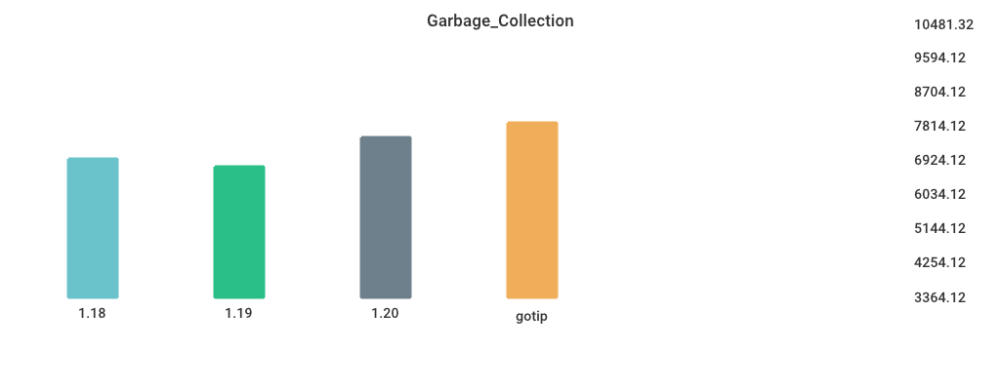

# Benchmarks

## Environment

NumCPU: 2

Arch: amd64

OS: linux

Version: go1.19.2

Itercount: 10

### CPU 0

Model: Intel(R) Xeon(R) Platinum 8370C CPU @ 2.80GHz

Cores: 1

Mhz: 2793.589000

CacheSize: 49152

Microcode: 0xffffffff

### CPU 1

Model: Intel(R) Xeon(R) Platinum 8370C CPU @ 2.80GHz

Cores: 1

Mhz: 2793.589000

CacheSize: 49152

Microcode: 0xffffffff

## CGO_CALL_C_FUNC

| Version | Build Time (ms) | Standard Deviation | Run Time (ms) | Standard Deviation |
| ------ | ------ | ------ | ------ | ------ |
| 1.17 | 460.179088 | 11.597836 | 4018.135426 | 1.818084 |
| 1.18 | 466.817033 | 5.081994 | 3616.525084 | 2.386977 |
| 1.19 | 523.278638 | 7.634173 | 3615.511247 | 10.408139 |
| gotip | 3820.123249 | 39.151631 | 3682.615802 | 1.544420 |

## Fibonacci

| Version | Build Time (ms) | Standard Deviation | Run Time (ms) | Standard Deviation |
| ------ | ------ | ------ | ------ | ------ |
| 1.17 | 125.640939 | 11.314485 | 4792.304503 | 0.849601 |
| 1.18 | 130.064778 | 3.013301 | 4797.495732 | 96.542269 |
| 1.19 | 139.725412 | 4.521523 | 4791.928867 | 73.195602 |
| gotip | 2732.439156 | 16.740514 | 4794.207815 | 1.452342 |

## Garbage_Collection

| Version | Build Time (ms) | Standard Deviation | Run Time (ms) | Standard Deviation |
| ------ | ------ | ------ | ------ | ------ |
| 1.17 | 134.889856 | 3.033867 | 5230.294417 | 38.380228 |
| 1.18 | 135.876251 | 3.318741 | 5201.571197 | 22.596829 |
| 1.19 | 144.570813 | 4.206090 | 5213.522672 | 375.980738 |
| gotip | 2844.236295 | 23.845778 | 6086.773063 | 21.282972 |

## Goroutine_Creation

| Version | Build Time (ms) | Standard Deviation | Run Time (ms) | Standard Deviation |
| ------ | ------ | ------ | ------ | ------ |
| 1.17 | 137.963224 | 3.755675 | 10366.101042 | 55.596705 |
| 1.18 | 144.695296 | 2.820038 | 6396.430061 | 64.218693 |
| 1.19 | 147.220124 | 3.633437 | 10503.148516 | 35.514885 |
| gotip | 2936.730927 | 32.784802 | 10659.003377 | 41.906635 |

## MergeSort

| Version | Build Time (ms) | Standard Deviation | Run Time (ms) | Standard Deviation |
| ------ | ------ | ------ | ------ | ------ |
| 1.17 | 132.666444 | 7.942202 | 6217.462285 | 56.373487 |
| 1.18 | 136.748348 | 2.200668 | 5936.493862 | 104.751196 |
| 1.19 | 149.324746 | 5.458989 | 7555.444217 | 61.532004 |
| gotip | 2855.008942 | 44.795413 | 8350.869308 | 112.611591 |

## Sort_Random

| Version | Build Time (ms) | Standard Deviation | Run Time (ms) | Standard Deviation |
| ------ | ------ | ------ | ------ | ------ |
| 1.17 | 145.778798 | 3.618159 | 6068.255998 | 2.740627 |
| 1.18 | 147.524580 | 2.417076 | 5981.810782 | 3.713471 |
| 1.19 | 148.480714 | 4.666331 | 5918.677727 | 10.442209 |
| gotip | 3294.561907 | 24.147899 | 6143.690061 | 6.657718 |

## Sort_Reversed

| Version | Build Time (ms) | Standard Deviation | Run Time (ms) | Standard Deviation |
| ------ | ------ | ------ | ------ | ------ |
| 1.17 | 133.854750 | 3.788773 | 3622.576085 | 19.753474 |
| 1.18 | 136.139298 | 1.694610 | 3542.718706 | 1.626826 |
| 1.19 | 141.852387 | 2.085507 | 360.745892 | 2.369616 |
| gotip | 3056.689721 | 19.994614 | 360.585367 | 0.244088 |

## TimeAfterFunc

| Version | Build Time (ms) | Standard Deviation | Run Time (ms) | Standard Deviation |
| ------ | ------ | ------ | ------ | ------ |
| 1.17 | 147.334538 | 55.098993 | 4493.099294 | 977.937041 |
| 1.18 | 152.802235 | 80.320425 | 5318.699120 | 677.850606 |
| 1.19 | 155.872766 | 98.566030 | 4949.937058 | 375.961183 |
| gotip | 3725.894407 | 69.825004 | 5110.636536 | 203.773689 |

## alloc_1.5k

| Version | Build Time (ms) | Standard Deviation | Run Time (ms) | Standard Deviation |
| ------ | ------ | ------ | ------ | ------ |
| 1.17 | 124.458099 | 3.224310 | 3683.487978 | 11.562929 |
| 1.18 | 127.803586 | 3.116373 | 5216.231027 | 1.072832 |
| 1.19 | 138.215371 | 2.292387 | 2705.719904 | 2.228818 |
| gotip | 2735.084782 | 15.624617 | 2705.469940 | 0.612064 |

## regexp_Compile

| Version | Build Time (ms) | Standard Deviation | Run Time (ms) | Standard Deviation |
| ------ | ------ | ------ | ------ | ------ |
| 1.17 | 164.709170 | 10.870888 | 1080.248389 | 7.331918 |
| 1.18 | 165.478962 | 9.137287 | 1111.300247 | 4.149223 |
| 1.19 | 173.572600 | 15.171339 | 1146.129167 | 4.719887 |
| gotip | 4050.380167 | 32.727045 | 1114.375367 | 3.714782 |

## regexp_FindAllString

| Version | Build Time (ms) | Standard Deviation | Run Time (ms) | Standard Deviation |
| ------ | ------ | ------ | ------ | ------ |
| 1.17 | 168.048702 | 3.816491 | 2343.212442 | 55.244795 |
| 1.18 | 171.256837 | 3.842288 | 2324.108825 | 12.132606 |
| 1.19 | 169.562833 | 2.635517 | 2200.518398 | 18.144314 |
| gotip | 3948.389865 | 41.158570 | 2176.911214 | 27.352037 |

## switch_case

| Version | Build Time (ms) | Standard Deviation | Run Time (ms) | Standard Deviation |
| ------ | ------ | ------ | ------ | ------ |
| 1.17 | 191.313249 | 12.600420 | 5937.443824 | 22.384315 |
| 1.18 | 192.815412 | 11.343653 | 5965.464584 | 31.596905 |
| 1.19 | 197.347121 | 12.102053 | 3505.132632 | 3.555895 |
| gotip | 5213.477625 | 36.481586 | 3506.870404 | 5.743939 |

