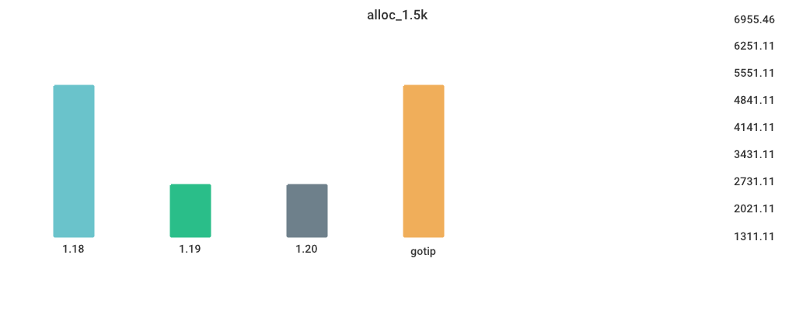

# Benchmarks

## Environment

NumCPU: 2

Arch: amd64

OS: linux

Version: go1.19.9

Itercount: 10

### CPU 0

Model: Intel(R) Xeon(R) Platinum 8370C CPU @ 2.80GHz

Cores: 1

Mhz: 2793.437000

CacheSize: 49152

Microcode: 0xffffffff

### CPU 1

Model: Intel(R) Xeon(R) Platinum 8370C CPU @ 2.80GHz

Cores: 1

Mhz: 2793.437000

CacheSize: 49152

Microcode: 0xffffffff

## CGO_CALL_C_FUNC

| Version | Build Time (ms) | Standard Deviation | Run Time (ms) | Standard Deviation |
| ------ | ------ | ------ | ------ | ------ |
| 1.18 | 459.390446 | 4.393372 | 3618.313433 | 1.767275 |
| 1.19 | 474.774421 | 4.900214 | 3613.904402 | 307.920272 |
| 1.20 | 412.559382 | 2.543951 | 3634.313708 | 5.877814 |
| gotip | 448.458779 | 8.042194 | 3651.374945 | 28.998688 |

## Fibonacci

| Version | Build Time (ms) | Standard Deviation | Run Time (ms) | Standard Deviation |
| ------ | ------ | ------ | ------ | ------ |
| 1.18 | 115.049813 | 7.638457 | 4798.644364 | 71.673053 |
| 1.19 | 107.681822 | 4.453581 | 4792.749257 | 2.298338 |
| 1.20 | 113.453515 | 3.301945 | 4795.620446 | 2.112378 |
| gotip | 112.093984 | 3.915945 | 5206.067624 | 1.435670 |

## Garbage_Collection

| Version | Build Time (ms) | Standard Deviation | Run Time (ms) | Standard Deviation |
| ------ | ------ | ------ | ------ | ------ |
| 1.18 | 124.561015 | 2.743543 | 5211.944610 | 26.935969 |
| 1.19 | 108.993689 | 9.133405 | 5207.343942 | 18.784785 |
| 1.20 | 114.799622 | 3.336760 | 6130.308350 | 50.541901 |
| gotip | 113.259805 | 3.927167 | 6640.327133 | 259.718054 |

## Goroutine_Creation

| Version | Build Time (ms) | Standard Deviation | Run Time (ms) | Standard Deviation |
| ------ | ------ | ------ | ------ | ------ |
| 1.18 | 126.174174 | 1.644556 | 6150.728753 | 66.299917 |
| 1.19 | 108.584112 | 19.049974 | 10378.000109 | 35.746028 |
| 1.20 | 117.147512 | 3.930491 | 10497.441685 | 65.568136 |
| gotip | 114.563173 | 4.012575 | 6254.746092 | 23.346873 |

## MergeSort

| Version | Build Time (ms) | Standard Deviation | Run Time (ms) | Standard Deviation |
| ------ | ------ | ------ | ------ | ------ |
| 1.18 | 119.256914 | 3.264924 | 5783.506430 | 39.555476 |
| 1.19 | 116.278890 | 11.368531 | 7392.394529 | 44.289761 |
| 1.20 | 114.611345 | 4.049032 | 8031.811483 | 31.588302 |
| gotip | 113.460329 | 3.698392 | 8258.017768 | 47.241053 |

## Sort_Random

| Version | Build Time (ms) | Standard Deviation | Run Time (ms) | Standard Deviation |
| ------ | ------ | ------ | ------ | ------ |
| 1.18 | 137.911218 | 2.403604 | 5978.669321 | 5.401358 |
| 1.19 | 115.417981 | 2.161910 | 5929.542963 | 16.635575 |
| 1.20 | 125.293578 | 4.126412 | 6007.759010 | 7.336950 |
| gotip | 125.055905 | 5.859992 | 5965.948814 | 5.771267 |

## Sort_Reversed

| Version | Build Time (ms) | Standard Deviation | Run Time (ms) | Standard Deviation |
| ------ | ------ | ------ | ------ | ------ |
| 1.18 | 125.539085 | 2.432426 | 3543.814175 | 3.065139 |
| 1.19 | 111.727645 | 6.753767 | 361.334467 | 0.388759 |
| 1.20 | 115.952014 | 2.599141 | 361.730779 | 0.626501 |
| gotip | 112.116187 | 2.738561 | 367.336288 | 1.921218 |

## TimeAfterFunc

| Version | Build Time (ms) | Standard Deviation | Run Time (ms) | Standard Deviation |
| ------ | ------ | ------ | ------ | ------ |
| 1.18 | 139.309131 | 4.887436 | 5395.497614 | 976.839223 |
| 1.19 | 124.017353 | 17.906635 | 5298.534814 | 598.358257 |
| 1.20 | 130.041601 | 5.566861 | 5120.357292 | 263.686113 |
| gotip | 126.002112 | 3.134037 | 5241.805383 | 315.564555 |

## alloc_1.5k

| Version | Build Time (ms) | Standard Deviation | Run Time (ms) | Standard Deviation |
| ------ | ------ | ------ | ------ | ------ |
| 1.18 | 118.801089 | 16.034042 | 5220.140333 | 1.163611 |
| 1.19 | 109.663782 | 4.025768 | 2705.940588 | 1.182819 |
| 1.20 | 110.931267 | 1.590734 | 2705.993848 | 1.431410 |
| gotip | 111.571964 | 2.854576 | 2705.935994 | 0.455172 |

## regexp_Compile

| Version | Build Time (ms) | Standard Deviation | Run Time (ms) | Standard Deviation |
| ------ | ------ | ------ | ------ | ------ |
| 1.18 | 151.866501 | 7.535966 | 1113.486678 | 10.796059 |
| 1.19 | 133.135337 | 3.348983 | 1146.885111 | 5.048794 |
| 1.20 | 136.963557 | 3.520791 | 1105.359892 | 8.232018 |
| gotip | 134.872822 | 4.200332 | 1062.709942 | 3.601817 |

## regexp_FindAllString

| Version | Build Time (ms) | Standard Deviation | Run Time (ms) | Standard Deviation |
| ------ | ------ | ------ | ------ | ------ |
| 1.18 | 158.330943 | 3.843719 | 2333.305403 | 76.433971 |
| 1.19 | 137.379255 | 2.012594 | 2195.421556 | 8.894021 |
| 1.20 | 144.554844 | 4.130673 | 2155.306443 | 20.769136 |
| gotip | 140.665255 | 3.746501 | 2123.375283 | 25.008474 |

## switch_case

| Version | Build Time (ms) | Standard Deviation | Run Time (ms) | Standard Deviation |
| ------ | ------ | ------ | ------ | ------ |
| 1.18 | 183.007273 | 25.721511 | 5937.864293 | 26.564975 |
| 1.19 | 155.755105 | 7.677914 | 3510.770084 | 8.489124 |
| 1.20 | 166.121213 | 3.975880 | 3531.854783 | 9.346394 |
| gotip | 163.184811 | 4.318842 | 2827.924214 | 5.248305 |

