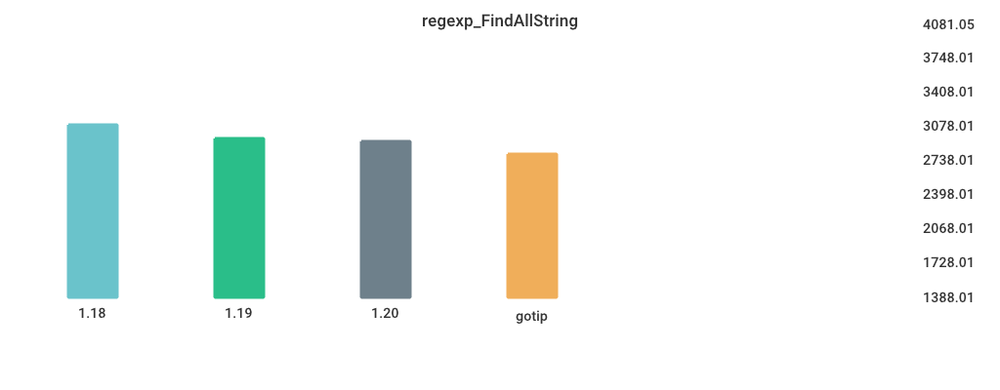

# Benchmarks

## Environment

NumCPU: 2

Arch: amd64

OS: linux

Version: go1.18.3

Itercount: 10

### CPU 0

Model: Intel(R) Xeon(R) Platinum 8370C CPU @ 2.80GHz

Cores: 1

Mhz: 2793.440000

CacheSize: 49152

Microcode: 0xffffffff

### CPU 1

Model: Intel(R) Xeon(R) Platinum 8370C CPU @ 2.80GHz

Cores: 1

Mhz: 2793.440000

CacheSize: 49152

Microcode: 0xffffffff

## regexp_Compile

| Version | Build Time (ms) | Standard Deviation | Run Time (ms) | Standard Deviation |
| ------ | ------ | ------ | ------ | ------ |
| 1.17 | 158.375529 | 4.934805 | 1078.020085 | 11.818033 |
| 1.18 | 170.644825 | 10.579791 | 1115.466339 | 6.074196 |
| 1.19beta1 | 306.773638 | 5.777486 | 1134.690954 | 7.625895 |
| 1.19rc1 | 186.034309 | 13.826922 | 1141.741824 | 13.251838 |
| gotip | 194.556498 | 6.414228 | 1157.561480 | 7.589844 |

## regexp_FindAllString

| Version | Build Time (ms) | Standard Deviation | Run Time (ms) | Standard Deviation |
| ------ | ------ | ------ | ------ | ------ |
| 1.17 | 167.042685 | 2.396067 | 2351.350953 | 23.108403 |
| 1.18 | 174.570455 | 3.131812 | 2338.317171 | 11.898783 |
| 1.19beta1 | 315.031460 | 2.837718 | 2190.227302 | 11.942060 |
| 1.19rc1 | 195.504370 | 4.502899 | 2192.031713 | 51.215563 |
| gotip | 196.107291 | 4.375622 | 2197.318663 | 8.385135 |

## alloc_1.5k

| Version | Build Time (ms) | Standard Deviation | Run Time (ms) | Standard Deviation |
| ------ | ------ | ------ | ------ | ------ |
| 1.17 | 123.888655 | 5.634296 | 3702.750838 | 12.164594 |
| 1.18 | 131.042383 | 4.145739 | 5217.487315 | 1.025496 |
| 1.19beta1 | 279.142714 | 5.657235 | 5217.175246 | 0.603674 |
| 1.19rc1 | 158.838178 | 3.884602 | 2707.580777 | 2.393347 |
| gotip | 158.699622 | 2.614089 | 2707.538452 | 2.034243 |

## Fibonacci

| Version | Build Time (ms) | Standard Deviation | Run Time (ms) | Standard Deviation |
| ------ | ------ | ------ | ------ | ------ |
| 1.17 | 123.838749 | 2.650074 | 4794.740144 | 3.308015 |
| 1.18 | 131.990318 | 3.240707 | 4799.699984 | 6.005889 |
| 1.19beta1 | 273.284504 | 4.279819 | 4798.323719 | 16.281904 |
| 1.19rc1 | 151.409437 | 2.921544 | 4793.679584 | 1.078191 |
| gotip | 154.722516 | 4.446633 | 4793.299908 | 0.794203 |

## MergeSort

| Version | Build Time (ms) | Standard Deviation | Run Time (ms) | Standard Deviation |
| ------ | ------ | ------ | ------ | ------ |
| 1.17 | 128.444590 | 9.431085 | 6114.974116 | 42.598505 |
| 1.18 | 135.034727 | 2.525708 | 5915.639637 | 45.276578 |
| 1.19beta1 | 283.337326 | 8.651558 | 7180.551812 | 76.513400 |
| 1.19rc1 | 156.985529 | 8.512400 | 7207.574788 | 47.709368 |
| gotip | 163.478234 | 6.353079 | 7490.771871 | 42.610146 |

## Sort_Random

| Version | Build Time (ms) | Standard Deviation | Run Time (ms) | Standard Deviation |
| ------ | ------ | ------ | ------ | ------ |
| 1.17 | 145.422147 | 2.940003 | 6089.327274 | 10.372734 |
| 1.18 | 149.954881 | 6.149696 | 5987.703149 | 16.033088 |
| 1.19beta1 | 295.157090 | 2.226965 | 5937.425675 | 11.976902 |
| 1.19rc1 | 168.912191 | 4.099119 | 5940.786014 | 9.356096 |
| gotip | 171.742341 | 3.687477 | 5919.048892 | 8.875065 |

## Sort_Reversed

| Version | Build Time (ms) | Standard Deviation | Run Time (ms) | Standard Deviation |
| ------ | ------ | ------ | ------ | ------ |
| 1.17 | 134.253451 | 3.186946 | 3645.348138 | 28.018322 |
| 1.18 | 141.735834 | 2.187265 | 3544.355723 | 5.591548 |
| 1.19beta1 | 276.765855 | 4.927799 | 394.444242 | 1.919827 |
| 1.19rc1 | 152.029463 | 2.842526 | 361.264230 | 0.525727 |
| gotip | 157.884323 | 2.781204 | 361.154880 | 0.437273 |

## switch_case

| Version | Build Time (ms) | Standard Deviation | Run Time (ms) | Standard Deviation |
| ------ | ------ | ------ | ------ | ------ |
| 1.17 | 196.880002 | 7.308798 | 5905.139706 | 25.085830 |
| 1.18 | 198.564003 | 12.411303 | 5903.111394 | 23.887715 |
| 1.19beta1 | 344.213562 | 6.535607 | 3419.829857 | 12.701616 |
| 1.19rc1 | 234.143795 | 19.406096 | 3565.849500 | 6.090277 |
| gotip | 236.419432 | 11.170709 | 3531.002704 | 8.338475 |

## TimeAfterFunc

| Version | Build Time (ms) | Standard Deviation | Run Time (ms) | Standard Deviation |
| ------ | ------ | ------ | ------ | ------ |
| 1.17 | 149.512259 | 3.278743 | 5231.230171 | 967.010231 |
| 1.18 | 157.064386 | 90.975218 | 4790.886338 | 679.698459 |
| 1.19beta1 | 291.694129 | 338.859208 | 4772.953515 | 540.670457 |
| 1.19rc1 | 174.879565 | 88.622133 | 4908.419846 | 422.676397 |
| gotip | 174.485192 | 16.510940 | 4780.219139 | 621.812271 |

